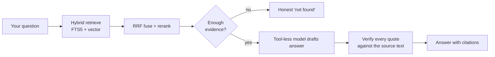
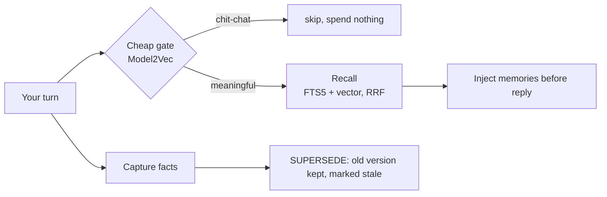

<h1 align="center">🧠 MemoHood &nbsp;·&nbsp; 📚 MemoBase</h1>

<p align="center"><b>MemoHood and MemoBase are two <b>hermes-agent</b> plugins that give an AI agent long-term memory and a private, on-disk knowledge base — each a single local SQLite file, with zero changes to the agent's core.</b></p>

<p align="center">

= 0.18">


</p>

<p align="center">
<a href="#quick-start">Quick start</a> ·
<a href="#how-it-works">How it works</a> ·
<a href="#how-it-compares">Comparison</a> ·
<a href="#faq">FAQ</a> ·
<a href="#limitations">Limitations</a> ·
<a href="README.ru.md">🇷🇺 Русский</a>
</p>

<p align="center"></p>
<p align="center"><sub>Scripted terminal illustration of the intended flow — memory recall, a source-verified quote, and an honest refusal.</sub></p>

Most AI agents have two problems. They have **amnesia** — close the chat and everything about you is gone. And they **make things up** with a straight face when they don't know something. MemoHood fixes the first, MemoBase fixes the second. Both are plugins: you install them, enable them, and the agent's core is never touched.

## What you get

- 🧠 **Memory that survives sessions** — the agent recalls what matters before every reply, on its own, instead of starting from zero each chat.
- 📚 **Answers grounded in your own files** — a verbatim quote from your document, or an honest "not in here" — never a guess.
- 🔒 **Local-first** — the database and your documents stay in a SQLite file on your disk; only the query text and the matched snippet ever leave it, headed to an embedding/rerank API.
- 🪶 **Lightweight** — standard library plus light MIT/BSD dependencies. No PyTorch, no gigabytes of weights, no AGPL. Installs on a cheap 2–4 GB VPS in seconds.
- 🔌 **Drop-in plugins** — installed through hermes' official extension points; the core is never patched.
- 🔎 **Hybrid search** — full-text (FTS5/BM25) + vector, fused with RRF, so it finds by meaning *and* by exact term, code or name.
- 🗣️ **Unusual sources** — whole YouTube channels (with a cost estimate up front), voice notes via Whisper with real timecodes, read-only Obsidian vaults.

## The two plugins

| Plugin | What it is | One-line pitch |
|---|---|---|
| **MemoHood** (`plugins/memohood`) | Dialogue memory — a hermes `MemoryProvider` | Turns an agent with amnesia into one that remembers you and never confuses an old decision with a new one. |
| **MemoBase** (`plugins/hermes-kb`) | Knowledge base over documents & media | NotebookLM that lives on your disk: every answer is a quote from your sources, or an honest "not found". |

They complement each other: **MemoHood** remembers *you and the conversation*, **MemoBase** knows *what's inside your files*. Run one or both.

## How it works

**MemoBase — answering a question:**



The "quote or refuse" rule is **not a prompt instruction — it is a step in code**: every citation is checked verbatim against the original chunk, so a hallucinated quote physically cannot pass.

**MemoHood — one turn:**



When a new fact contradicts an old one, the old one is **not deleted** — it is marked stale and moved to history, with a date. You always see both what you decided now and what came before.

Full picture: [design notes](docs/PLUGINS.md) · [mind-map of each plugin](docs/MINDMAPS.md).

## Quick start

Both plugins ship with their own installer and `GUIDE.md` — those are the authoritative steps. The gist:

```bash
# 1. Put each plugin where hermes looks for it
#    MemoHood is a memory provider — the folder MUST be named "memohood":
cp -r plugins/memohood  ~/.hermes/plugins/memohood
cp -r plugins/hermes-kb ~/.hermes/plugins/memobase

# 2. Install dependencies (see each plugin's install.sh / install.ps1)
plugins/hermes-kb/install.sh        # or install.ps1 on Windows

# 3. Enable them in ~/.hermes/config.yaml
#    memory.provider: memohood
#    plugins.enabled: [ memobase ]
```

Exact, verified steps (config keys, required API keys, degradation without keys):
→ [plugins/memohood/GUIDE.md](plugins/memohood/GUIDE.md) · [plugins/hermes-kb/GUIDE.md](plugins/hermes-kb/GUIDE.md)

## Tools each plugin adds

| MemoHood | MemoBase |
|---|---|
| `memohood_search` · `memohood_recall` · `memohood_capture` · `memohood_fetch` · `memohood_stats` · `recall_all` | `memobase_ingest` · `memobase_ask` · `memobase_query` · `memobase_list` · `memobase_status` · `memobase_selfcheck` |
| Auto-recall runs before every turn — you don't call it. | Slash command `/memobase`, CLI `hermes memobase …`, onboarding wizard. |

## How it compares

**Knowledge base (MemoBase) vs. the usual stacks:**

| Criterion | MemoBase | Weaviate / Elasticsearch | Postgres + pgvector | NotebookLM / Perplexity |
|---|---|---|---|---|
| Deployment | one SQLite file on disk | separate search server | separate database | cloud service |
| Hybrid FTS + vector + RRF | ✅ built in | ✅ | ✅ (in app code) | n/a |
| Citation-or-refuse, verified in code | ✅ | ❌ | ❌ | partial (cloud) |
| Data stays local | ✅ | self-host only | self-host only | ❌ |

**Dialogue memory (MemoHood) vs. agent-memory projects:**

| Criterion | MemoHood | mem0 | Letta (MemGPT) | Zep |
|---|---|---|---|---|
| Auto-recall before every turn | ✅ | ✅ | ❌ (agent decides) | ✅ |
| Cheap gate before expensive LLM | ✅ Model2Vec | ❌ | ❌ | ❌ |
| Hybrid FTS + vector (not vector-only) | ✅ | ❌ vector-only | varies | graph-based |
| Old facts kept, not overwritten | ✅ SUPERSEDE | ❌ | ❌ | ✅ (temporal graph) |
| Runs as a plugin, no core changes | ✅ | ❌ library/service | ❌ framework | ❌ service |

The direction — hybrid search with RRF, "answer only from sources", versioned memory — is the same one the big players took. The difference is the packaging: a single local file, as a plugin, private by default.

## FAQ

**Is it free?** Yes — MIT licensed, © Maxim Vasko.

**Does my data leave my machine?** Your documents and the database stay local. Only the **query text and the matched snippet** go out — to the embedding API (Cloudflare BGE-M3), the optional reranker (Cohere), and, for fact extraction, one Gemini call. Nothing gets uploaded wholesale.

**Do I need a GPU?** No. There is no PyTorch and no local model weights.

**Does it modify hermes?** No. Both plugins use hermes' official extension points only; the core is never patched.

**What can MemoBase ingest?** PDF, DOCX, HTML/URL, MD/TXT/CSV, YouTube videos and whole channels, audio/voice (Whisper), and read-only Obsidian vaults.

**Can I run both at once?** Yes. MemoHood handles dialogue memory, MemoBase handles document knowledge; they don't overlap.

**Which languages?** Russian-first (with stemming) and English.

## Limitations

- **Not fully offline.** Embeddings, optional rerank and fact-extraction are cloud API calls — the query text and snippets go out to them. The database and documents stay on your disk.
- **Needs a host.** Requires `hermes-agent ≥ 0.18`; these are plugins, not a standalone app.
- **Keys for full power.** Cloudflare (embeddings), Gemini (extraction) and, for MemoBase, source keys (Groq/Cohere/etc.) unlock full functionality; without them the plugins degrade gracefully rather than fail.
- **Install tested on Windows and Linux** (PowerShell and POSIX installers provided).

## Status

Both plugins are implemented and tested (MemoBase: 285 tests; MemoHood: 180+ tests, all local). Design rationale lives in [HERMES_UPGRADES.md](HERMES_UPGRADES.md). Updated: 2026-07.

## License

MIT — free for personal and commercial use. © Maxim Vasko. See [LICENSE](LICENSE).

---

<p align="center">Made by <b>Maxim Vasko</b> · <a href="https://skorehood.com">skorehood.com</a> · <a href="https://www.youtube.com/@MaximSkorohood">YouTube @MaximSkorohood</a></p>
