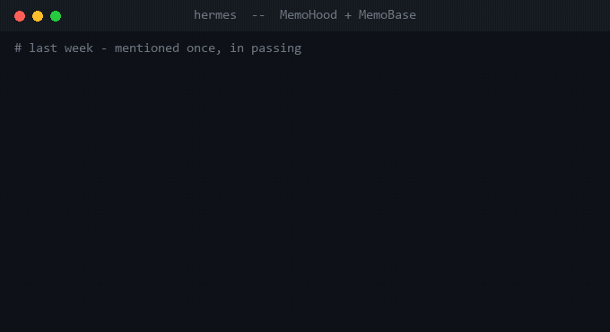
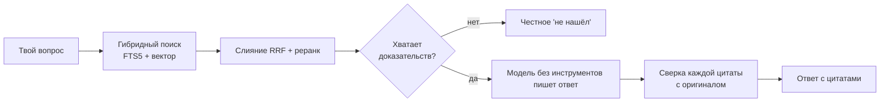
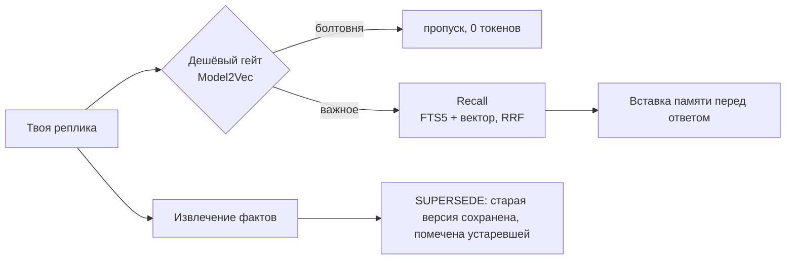

<h1 align="center">🧠 MemoHood &nbsp;·&nbsp; 📚 MemoBase</h1>

<p align="center"><b>MemoHood и MemoBase — два плагина для AI-агента <b>hermes</b>, которые дают ему долговременную память и приватную базу знаний на диске. Каждый — один локальный файл SQLite, без единой правки ядра агента.</b></p>

<p align="center">

= 0.18">


</p>

<p align="center">
<a href="#быстрый-старт">Быстрый старт</a> ·
<a href="#как-это-работает">Как работает</a> ·
<a href="#сравнение">Сравнение</a> ·
<a href="#faq">FAQ</a> ·
<a href="#ограничения">Ограничения</a> ·
<a href="README.md">🇬🇧 English</a>
</p>

<p align="center"></p>
<p align="center"><sub>Постановочная иллюстрация в терминале: recall памяти, цитата со сверкой по источнику и честный отказ.</sub></p>

У любого AI-агента две болезни. **Амнезия** — закрыл чат, и он забыл про тебя всё. Ещё он **выдумывает** — с уверенным видом несёт то, чего не знает. MemoHood лечит первое, MemoBase — второе. Оба — плагины: ставишь, включаешь, ядро агента не трогаешь.

## Что ты получаешь

- 🧠 **Память, которая живёт между сессиями** — агент сам вспоминает нужные факты перед каждым ответом, а не забывает тебя после каждого чата.
- 📚 **Ответы строго по твоим файлам** — дословная цитата из документа или честное «этого здесь нет», но не выдуманный факт.
- 🔒 **Локально** — база и документы лежат в файле SQLite на твоём диске; наружу уходит только текст вопроса и найденный фрагмент.
- 🪶 **Легко** — стандартная библиотека и лёгкие MIT/BSD-зависимости. Без PyTorch, без гигабайтов весов, без AGPL. Ставится на дешёвый VPS 2–4 ГБ за секунды.
- 🔌 **Плагины, а не форк** — подключаются через штатные точки расширения hermes; ядро не патчится.
- 🔎 **Гибридный поиск** — полнотекстовый (FTS5/BM25) + вектор, слияние через RRF: находит и по смыслу, и по точному слову, коду, имени.
- 🗣️ **Необычные источники** — целые YouTube-каналы (со сметой стоимости), голосовые через Whisper с настоящими таймкодами, Obsidian только на чтение.

## Два плагина

| Плагин | Что это | В одну строку |
|---|---|---|
| **MemoHood** (`plugins/memohood`) | Память диалога — hermes `MemoryProvider` | Превращает агента с амнезией в того, кто помнит тебя и не путает старое решение с новым. |
| **MemoBase** (`plugins/hermes-kb`) | База знаний по документам и медиа | NotebookLM у тебя на диске: каждый ответ — цитата из твоих источников или честное «не нашёл». |

Они дополняют друг друга: **MemoHood** помнит *тебя и диалог*, **MemoBase** знает *что внутри твоих файлов*. Можно ставить один или оба.

## Как это работает

**MemoBase — ответ на вопрос:**



Правило «цитата или отказ» зашито не в промпт, а **в код**: каждая цитата дословно сверяется с оригиналом. Выдумать источник не выйдет — программа поймает.

**MemoHood — один ход:**



Когда новый факт противоречит старому, старый **не стирается** — помечается устаревшим и уходит в историю с датой. Всегда видно, что ты решил сейчас и что было раньше.

Полная картина: [заметки по дизайну](docs/PLUGINS.md) · [майнд-карта каждого плагина](docs/MINDMAPS.md).

## Быстрый старт

У каждого плагина свой установщик и `GUIDE.md` — там точные шаги. Суть:

```bash
# 1. Положить каждый плагин туда, где hermes его ищет.
#    MemoHood — провайдер памяти, папка ДОЛЖНА называться "memohood":
cp -r plugins/memohood  ~/.hermes/plugins/memohood
cp -r plugins/hermes-kb ~/.hermes/plugins/memobase

# 2. Установить зависимости (см. install.sh / install.ps1 у плагина)
plugins/hermes-kb/install.sh        # или install.ps1 на Windows

# 3. Включить в ~/.hermes/config.yaml
#    memory.provider: memohood
#    plugins.enabled: [ memobase ]
```

Точные проверенные шаги (ключи конфига, нужные API-ключи, деградация без ключей):
→ [plugins/memohood/GUIDE.md](plugins/memohood/GUIDE.md) · [plugins/hermes-kb/GUIDE.md](plugins/hermes-kb/GUIDE.md)

## Сравнение

**База знаний (MemoBase) против типовых стеков:**

| Критерий | MemoBase | Weaviate / Elasticsearch | Postgres + pgvector | NotebookLM / Perplexity |
|---|---|---|---|---|
| Развёртывание | один файл SQLite на диске | отдельный поисковый сервер | отдельная БД | облачный сервис |
| Гибрид FTS + вектор + RRF | ✅ встроен | ✅ | ✅ (в коде) | n/a |
| «Цитата или отказ», проверка в коде | ✅ | ❌ | ❌ | частично (облако) |
| Данные остаются локально | ✅ | только self-host | только self-host | ❌ |

**Память диалога (MemoHood) против проектов памяти:**

| Критерий | MemoHood | mem0 | Letta (MemGPT) | Zep |
|---|---|---|---|---|
| Авто-recall перед каждым ходом | ✅ | ✅ | ❌ (решает агент) | ✅ |
| Дешёвый гейт перед дорогим LLM | ✅ Model2Vec | ❌ | ❌ | ❌ |
| Гибрид FTS + вектор (не только вектор) | ✅ | ❌ только вектор | по-разному | граф |
| Старые факты не стираются | ✅ SUPERSEDE | ❌ | ❌ | ✅ (граф во времени) |
| Работает как плагин, без правки ядра | ✅ | ❌ библиотека/сервис | ❌ фреймворк | ❌ сервис |

Направление — гибридный поиск с RRF, «ответ только по источникам», версионируемая память — то же, что у больших игроков. Разница в упаковке: один локальный файл, плагином, приватно по умолчанию.

## FAQ

**Это бесплатно?** Да — лицензия MIT, © Maxim Vasko.

**Мои данные уходят наружу?** Документы и база остаются локально. Наружу уходит только **текст вопроса и найденный фрагмент** — в эмбеддинги (Cloudflare BGE-M3), опциональный реранк (Cohere) и один вызов Gemini для извлечения фактов. Файлы целиком никуда не улетают.

**Нужна ли видеокарта?** Нет. Ни PyTorch, ни локальных весов.

**Меняет ли это hermes?** Нет. Только штатные точки расширения; ядро не патчится.

**Что умеет заглатывать MemoBase?** PDF, DOCX, HTML/URL, MD/TXT/CSV, YouTube-видео и целые каналы, аудио/голос (Whisper), Obsidian (на чтение).

**Можно оба сразу?** Да. MemoHood — память диалога, MemoBase — знания по документам; не пересекаются.

**Какие языки?** Русский в первую очередь (со стеммингом) и английский.

## Ограничения

- **Не полностью офлайн.** Эмбеддинги, опциональный реранк и извлечение фактов — облачные вызовы; туда уходит текст вопроса и фрагментов. База и документы остаются на диске.
- **Нужен хост.** Требуется `hermes-agent ≥ 0.18`; это плагины, не отдельное приложение.
- **Ключи для полной силы.** Cloudflare (эмбеддинги), Gemini (извлечение) и для MemoBase — ключи источников; без них плагины деградируют мягко, а не падают.
- **Установка проверена на Windows и Linux** (есть установщики PowerShell и POSIX).

## Статус

Оба плагина реализованы и покрыты тестами (MemoBase: 285; MemoHood: 180+, все локальные). Обоснование дизайна — в [HERMES_UPGRADES.md](HERMES_UPGRADES.md). Обновлено: 2026-07.

## Лицензия

MIT — свободно для личного и коммерческого использования. © Maxim Vasko. См. [LICENSE](LICENSE).

---

<p align="center">Сделал <b>Maxim Vasko</b> · <a href="https://skorehood.com">skorehood.com</a> · <a href="https://www.youtube.com/@MaximSkorohood">YouTube @MaximSkorohood</a></p>
