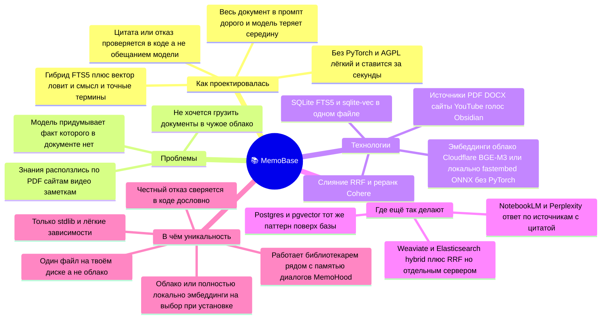
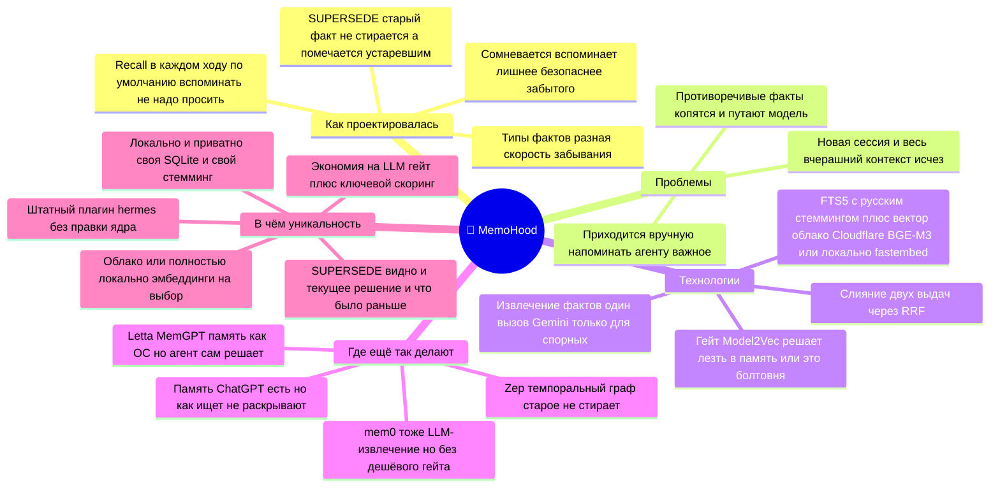

# Mind-maps: MemoBase & MemoHood

Две карты, по одной на плагин: как проектировался, какие проблемы решает, на чём построен,
кто из больших идёт тем же путём и в чём отличие. Рендерятся прямо на GitHub (mermaid).
Презентационные версии этих же карт — в Excalidraw (исходник для видео и соцсетей).

## 📚 MemoBase — база знаний

## 🧠 MemoHood — память диалога

> Цвет-код презентационных карт: как проектировалась · проблемы · технологии · где ещё так делают · уникальность.
