<h1 align="center">📚 MemoBase</h1>
<p align="center"><i>formerly hermes-kb</i></p>
<p align="center"><b>A plugin for hermes-agent that turns your files (PDF/DOCX/HTML/MD/TXT/CSV), web pages, YouTube videos and whole channels, audio recordings, and Obsidian notes into a local knowledge base — and answers strictly from it: with verbatim, verified citations, or an honest refusal when the answer isn't there.</b></p>

<p align="center">
  <a href="LICENSE"></a>
  <a href="#installation"></a>
  <a href="#installation">=0.18" src="https://img.shields.io/badge/hermes--agent-%3E%3D0.18-blueviolet"></a>
  <a href="tests/"></a>
  <a href="README.md"></a>
</p>

<p align="center">
  <a href="#why-you-need-it">Why</a> ·
  <a href="#features">Features</a> ·
  <a href="#installation">Installation</a> ·
  <a href="#settings">Settings</a> ·
  <a href="#tools-14-and-commands">Tools</a> ·
  <a href="README.md">Русский</a> ·
  <a href="https://skorehood.com">skorehood.com</a>
</p>

---

MemoBase is a separate module that runs alongside hermes, dedicated to *documents*. It does not replace hermes' own memory (conversation history, user profile — e.g. the MemoHood memory plugin): both can stay enabled at the same time without conflicting. MemoBase is a librarian, not a memory.

## Why you need it

When you ask an ordinary language model to answer from your document, there are two paths, and both are unreliable:

- **Paste the whole document into the prompt.** On long text the model gets "lost in the middle", is expensive (the full document goes into every request), and can paraphrase inaccurately — with no verification at all.
- **Rely on the model's general knowledge.** Then it confidently invents things that aren't in your documents.

MemoBase closes both gaps. Think of it as **NotebookLM, but local and right inside the agent**: you upload sources, and the plugin answers **using only what is actually in them** — with a verbatim quote, source, and page/section (or a timecode, for video and audio) attached to every claim. If the answer isn't in the base, MemoBase says so honestly ("this isn't in the knowledge base yet") instead of guessing.

Under the hood is a four-stage no-hallucination loop:

1. **Sufficiency gate.** Before the model is even allowed to answer, MemoBase checks whether search found a confidently relevant fragment. If not, it's an honest refusal — before generation.
2. **Answer from fragments only.** The answer is generated by a model with no other tools attached (tool-less) — it has physically nothing to "fill in" beyond the fragments handed to it.
3. **Verbatim citation check.** Every citation in the answer is matched against the source chunk's raw text (exact match, else fuzzy comparison) — a fabricated or inexact quote is dropped.
4. **Honest refusal.** If no verified citation survives, MemoBase returns a refusal rather than unverified text.

```mermaid
flowchart LR
    subgraph ING["Ingestion — memobase_ingest"]
        FILES["Files & URLs<br/>PDF / DOCX / HTML / MD / TXT / CSV"]
        OBS["Obsidian<br/>note or vault"]
        YT["YouTube<br/>video or channel"]
        AUD["Audio / voice / video"]
        CAPS{"Captions<br/>ScrapeCreators → Apify"}
        STT["STT transcription<br/>Groq Whisper → Gemini<br/>(segment timecodes)"]
        EXT["Text extraction<br/>(SSRF check for URLs)"]
        NORM["Normalization<br/>(encoding, boilerplate, dedup)"]
        CHUNK["Structural chunking<br/>(code-fence-safe)"]
        SCAN{"Secret scanner<br/>(blocking)"}
        EMB["Embedding<br/>Cloudflare BGE-M3"]
        FILES --> EXT
        OBS --> EXT
        YT --> CAPS
        CAPS -->|captions found| EXT
        CAPS -.->|"none — audio (Apify)"| STT
        AUD --> STT
        STT -->|timecoded text| EXT
        EXT --> NORM --> CHUNK --> SCAN
        SCAN -->|clean| EMB
        SCAN -.->|secret found| QUAR["Quarantined,<br/>not indexed"]
    end

    EMB --> DB[("memobase.db<br/>SQLite: FTS5 + vec0")]

    subgraph ASK["Question — memobase_ask / memobase_query"]
        Q["Question"]
        HYB["Hybrid search<br/>FTS5(BM25 + RU stemming) + vector KNN"]
        RRF["RRF fusion (k=60)"]
        RRK["Reranking<br/>Cohere rerank-v3.5"]
        GATE{"Sufficiency gate"}
        LLM["Tool-less model<br/>answers only from chunks"]
        VERIFY["Citation verification<br/>(verbatim, fuzzy-match)"]
        Q --> HYB
        DB --> HYB
        HYB --> RRF --> RRK --> GATE
        GATE -->|insufficient| REFUSE["Honest refusal:<br/>'not in the base'"]
        GATE -->|sufficient| LLM --> VERIFY --> ANSWER["Answer + citations + sources"]
    end
```



## Features

**Ingestion sources (`memobase_ingest`)**

- **Files and web pages:** PDF (via `pdfplumber`, falling back to `pypdf`), DOCX (`mammoth`), HTML and URLs (`trafilatura`, with an SSRF check), Markdown, TXT, CSV (row by row, keeping the table header attached).
- **YouTube — whole channels or one video at a time.** Captions come from ScrapeCreators (with Apify as the fallback); when a video has no captions at all, its audio is downloaded (via Apify) and transcribed with Groq Whisper — with real timecodes, so a citation points at the exact minute. For a channel above the threshold (20 videos by default), the plugin first shows a dollar estimate and asks for confirmation.
- **Audio, voice, and video (STT).** Groq Whisper (`whisper-large-v3-turbo`) by default, with timecodes from the decoder itself; long files are automatically split (`ffmpeg` required) and re-joined without losing text. Gemini is the fallback path (its timecodes are the model's own estimate, so those transcripts are flagged as lower-trust).
- **Obsidian — read-only.** The plugin discovers your vaults on its own via Obsidian's registry, ingests a single note or a whole vault, understands frontmatter and `[[wikilinks]]`, and skips housekeeping folders (`.obsidian/`, `.trash/`, `templates/`). MemoBase **never writes into a vault**.

**Search and answer**

- **Hybrid search that understands Russian.** Full-text search (FTS5, BM25) with Russian stemming on a dedicated column (PyStemmer, Snowball "russian" — "договора" finds "договор") plus semantic vector search (Cloudflare BGE-M3, 1024 dimensions). Results are fused with reciprocal rank fusion (RRF, k=60) and reranked with Cohere rerank-v3.5.
- **Answers that aren't invented, and an honest refusal.** Sufficiency gate → answer by a tool-less model from fragments only → verbatim citation check → refusal if nothing was verified (see the [Why](#why-you-need-it) section for details).
- **Local-first storage.** The whole base is a single SQLite file `<HERMES_HOME>/memobase/memobase.db` (the vector index is sqlite-vec, local). Only the text of the question and candidate chunks ever leaves the machine — for embedding (Cloudflare Workers AI) and reranking (Cohere). The source files and the rest of the database are never uploaded.
- **Base map and enrichment (optional).** `/memobase map` builds a mermaid map of a collection (documents, topics, Obsidian links, keyword overlaps). With `memobase.enrich.enabled` on, a cheap model writes each chunk a short "what this is and where it's from" note — it goes into the embedding only (fewer retrieval misses); the raw text and citation verification stay untouched.

**Guest collections**

- The owner can create a personal collection for a guest, grant or instantly revoke read/write access, and set quotas (storage, daily upload, daily budget, call count). Suspicious guest chunks (ones that look like injected instructions) aren't silently indexed — they go to a **quarantine** queue for the owner's manual review.

**6 built-in blockers** (protection that can't be switched off and doesn't rely on the model's "promises"):

1. **SSRF** — before any HTTP request to a URL (and during the size pre-check), the address is validated so the plugin can't reach into an internal network.
2. **Raw-chunk fencing** — `memobase_query` returns fragments wrapped as "this is data, not instructions" and runs them through the secret/injection scanner.
3. **RRF threshold in degraded mode** — without a Cohere key, search honestly falls back to `rrf-only` and applies a separate, calibrated sufficiency threshold for that mode.
4. **Shadow vector migration** — when the embedding model changes, the re-embedding is written to a shadow table and renamed atomically; during migration the collection doesn't serve inconsistent results.
5. **Sub-claim verification** — the answer is split into sub-claims, each of which must rest on a citation; uncited numeric/negative clauses are either matched against the fragment or downgraded in trust.
6. **Stale-chunk purge** — on re-ingesting a source, fragments that vanished from the new version are tombstoned and excluded from search — the base doesn't accumulate "ghosts" of deleted text.

**Prompt-injection defense on documents.** If an uploaded document contains text like "ignore previous instructions", MemoBase fences it as data, not commands, and flags it with a warning banner — both when handing raw fragments to a privileged caller (`memobase_query`) and during answer generation (`memobase_ask` calls the model with no other tools attached). A subagent bound to a specific collection is physically unable to reach a different one — the binding is enforced in code.

## Installation

Installation is file operations plus one setup script — it never calls the `hermes` CLI on your behalf.

1. Copy the plugin folder to `<HERMES_HOME>/plugins/memobase/` (on Windows, that's `%LOCALAPPDATA%\hermes\plugins\memobase` by default).
2. Install dependencies into the hermes-agent venv (ordinary plugins can't install their own dependencies):

   ```powershell
   # Windows
   .\install.ps1
   ```

   ```bash
   # Linux / macOS
   ./install.sh
   ```

   The script auto-detects the hermes-agent venv's python (via `hermes` on PATH, the `HERMES_VENV_PYTHON` env var, or the conventional `<HERMES_HOME>/hermes-agent/venv` layout) and installs: `sqlite-vec pdfplumber pypdf mammoth trafilatura>=1.8 ftfy py3langid PyStemmer requests`.

3. Add `memobase` to `plugins.enabled` in `config.yaml`:

   ```yaml
   plugins:
     enabled:
       - memobase
   ```

4. Check the keys in `~/.hermes/.env`. Only the base three are needed for search; the rest unlock additional sources — without them the corresponding source type is honestly skipped rather than crashing the plugin:

   | Key | Purpose | When you need it |
   |---|---|---|
   | `CLOUDFLARE_ACCOUNT_ID`, `CLOUDFLARE_API_TOKEN` | Embedding (Cloudflare Workers AI) | Always (core search) |
   | `COHERE_API_KEY` | Reranking (Cohere rerank-v3.5) | Always (otherwise degrades to RRF) |
   | `SCRAPECREATORS_API_KEY` | YouTube captions and channel listings | For YouTube ingestion |
   | `APIFY_TOKEN` | Fallback captions/listings + YouTube audio download | For YouTube videos without captions |
   | `GROQ_API_KEY` | Audio transcription (Groq Whisper) | For audio/voice and caption-less YouTube |
   | `GEMINI_API_KEY` | Fallback audio transcription (Gemini) | Optional, as the STT reserve |

5. Restart hermes and check:

   ```
   /memobase status
   ```

You don't have to type step 4's keys into `.env` by hand — there's a setup wizard: `/memobase setup` in Telegram, or `hermes memobase setup` in a terminal. It's the same flow with shared code: the questions, format and live provider key checks, Obsidian auto-detection, the `ffmpeg` check, a first upload, and a control question are identical either way. Wizard replies are intercepted before the LLM, so setup costs zero tokens. The easiest path for a newcomer is to enable the `hermes-setup` plugin once and send `/setup` in Telegram: it configures MemoBase (and the other plugins) one step at a time in plain language.

## Settings

All keys live under the `memobase.*` root in `config.yaml`; defaults are shown below. API keys go in `~/.hermes/.env`, not here (see [Installation](#installation)).

| Key | Type | Default | What it does |
|---|---|---|---|
| `memobase.embedder.provider` | str | `cloudflare` | Embedding provider: `cloudflare` (BGE-M3) or `openai-compat` (your own OpenAI-compatible server). |
| `memobase.embedder.model` | str | `@cf/baai/bge-m3` | Embedding model. |
| `memobase.embedder.dims` | int | `1024` | Vector dimension. |
| `memobase.embedder.base_url` | str | *(none)* | URL of your own embedding server — required only when `provider: openai-compat`. |
| `memobase.rerank.provider` | str | `cohere` | Reranking provider. |
| `memobase.rerank.model` | str | `rerank-v3.5` | Reranking model. |
| `memobase.rerank.enabled` | bool | `true` | Whether the rerank step runs (otherwise `rrf-only`). |
| `memobase.answer_model` | str | *(empty)* | Model for answer generation. Empty = the host's active model; you can point to a separate cheap one. |
| `memobase.default_collection` | str | `default` | The default collection. |
| `memobase.confirm_over_chunks` | int | `500` | Chunk-count threshold above which ingestion asks for cost confirmation. |
| `memobase.monthly_ceiling_usd.cloudflare` | number | `5` | Monthly spend ceiling for Cloudflare (USD). |
| `memobase.monthly_ceiling_usd.cohere` | number | `5` | Monthly spend ceiling for Cohere (USD). |
| `memobase.chunk.target_tokens` | int | `900` | Target chunk size in tokens. |
| `memobase.chunk.overlap_pct` | float | `0.15` | Overlap between adjacent chunks. |
| `memobase.youtube.confirm_over_videos` | int | `20` | Channel video-count threshold above which an estimate is shown and confirmation is asked. |
| `memobase.youtube.transcript_providers` | list | `[scrapecreators, apify]` | Caption-provider order with auto-failover. |
| `memobase.stt.preset` | str | `groq` | STT preset: `groq` (whisper-large-v3-turbo) or `gemini` (Gemini is still picked up as a fallback if Groq fails). |
| `memobase.enrich.enabled` | bool | `false` | Whether to enrich chunks with a contextual note at ingest time (an extra LLM call per chunk). |
| `memobase.enrich.model` | str | *(empty)* | Model for enrichment. Empty = the host's active model. |
| `memobase.owner_user_id` | str | *(empty)* | The owner's platform ID (e.g. Telegram user_id). Empty = "not claimed yet"; `/memobase setup` claims it for whoever runs the wizard first. |
| `memobase.guest_defaults.max_mb` | int | `200` | Guest quota: storage, MB. |
| `memobase.guest_defaults.max_chunks` | int | `4000` | Guest quota: chunk count. |
| `memobase.guest_defaults.daily_upload_mb` | int | `50` | Guest quota: daily upload, MB. |
| `memobase.guest_defaults.daily_budget_usd` | float | `0.50` | Guest quota: daily budget, USD. |
| `memobase.guest_defaults.daily_calls` | int | `200` | Guest quota: calls per day. |
| `memobase.guest_rate_limit.calls_per_minute` | int | `6` | Rate limit for guest `query`/`ask`, calls per minute. |
| `memobase.backup.keep` | int | `7` | How many nightly snapshots to keep on rotation. |
| `memobase.backup.disk_alert_pct` | int | `80` | Disk-usage alert threshold, %. |
| `memobase.canonical_host` | bool | `true` | Whether this instance is allowed to write to the base (relevant with multiple hermes on shared collections). |

> The sufficiency thresholds (`rerank` ≈ 0.15, `rrf-only` ≈ 0.02) are not `config.yaml` keys but default constants, used until a collection is calibrated with `memobase_selfcheck` (after calibration the values are stored per-collection in the DB). The RRF constant `k=60` is hard-coded and not configurable.

## Tools (14) and commands

The model sees 14 `memobase_*` tools; a human gets the same operations via `/memobase …` slash commands and `hermes memobase …` in a terminal.

| Tool | Command | What it does |
|---|---|---|
| `memobase_ingest` | `/memobase ingest <source> <type> [collection]` | Ingest a source. The slash command accepts files and URLs (`pdf`, `docx`, `html`, `url`, `md`, `txt`, `csv`); `youtube`, `audio`, `video`, `obsidian` are done by asking in chat with plain text. |
| `memobase_ask` | `/memobase <question>` | An answer from the collection with verified citations, or an honest refusal. |
| `memobase_query` | — | Raw fragments for a privileged caller, always fenced as "data, not instructions". |
| `memobase_list` | `/memobase list` | List collections: documents, chunks, visibility, state. |
| `memobase_status` | `/memobase status [collection]` | Migration state, pending jobs, 30-day spend per provider. |
| `memobase_delete` | `/memobase delete <collection>` | Delete an entire collection. |
| `memobase_selfcheck` | `/memobase selfcheck <collection>` | Quality smoke test: control questions against random chunks + threshold calibration. |
| `memobase_map` | `/memobase map [collection]` | A mermaid map of the collection: documents, topics, Obsidian links, keyword overlaps. |
| `memobase_create_for` | `/memobase create-for <user_id> <collection>` | Create a personal collection for a guest (owner only). |
| `memobase_share` | `/memobase share <collection> <user_id> [read\|write]` | Grant a guest access (owner only). |
| `memobase_share_revoke` | `/memobase share-revoke <collection> <user_id>` | Instantly revoke access (owner only). |
| `memobase_set_guest_quota` | `hermes memobase set-guest-quota …` | Set per-guest quotas (owner only). |
| `memobase_quarantine_list` | `/memobase quarantine [collection]` | The queue of guest chunks held by the injection scanner (owner only). |
| `memobase_quarantine_review` | `hermes memobase quarantine-review …` | Approve/reject a quarantined chunk (owner only). |

The six owner-only tools (`create_for`, `share`, `share_revoke`, `set_guest_quota`, `quarantine_list`, `quarantine_review`) verify identity **in code** (`_require_privileged`, from the session's server-side identity), not by trusting the model to behave.

Three more operations are terminal-only: `hermes memobase reindex` (re-embed after changing the embedding model), `hermes memobase backup-run` (a consistent `VACUUM INTO` snapshot with rotation — put it on cron), and `hermes memobase setup` (the setup wizard). Plus `/memobase setup` and `/memobase help`.

## Example: ingest a document → ask with a citation

```
/memobase ingest ./contract.pdf pdf
/memobase What's the contract's term?
```

The answer comes back with a verbatim quote, source, and page — for example:

```
The contract's term is 12 months from the date of signing.

Quote [1]: "This Agreement enters into force upon signing and
remains in effect for 12 (twelve) months."
Source: contract.pdf, p. 3
```

If no such clause exists in the document, MemoBase returns an honest refusal like "this isn't in the knowledge base yet" rather than inventing a term.

## Tests

```
285 passed, 2 deselected (integration tests are marked "not integration" and skipped)
```

Run from a neutral directory (not from inside the plugin folder — otherwise the local `tools.py` shadows the core package):

```
<venv>/python.exe -m pytest tests -q --basetemp=D:/tmp_readme/memobase -m "not integration"
```

## Limitations

- There is still no fully local (no external API) embedding engine: the question and chunks are sent to the cloud for embedding/reranking. The plumbing exists — you can point the plugin at your own OpenAI-compatible server (`memobase.embedder.provider: openai-compat` + `base_url`). The setup wizard can already record a "local" choice, but the engine behind it doesn't exist yet.
- No true resume mid-embedding-batch — a job either finishes or restarts from the last completed stage (already-ingested chunks are never lost, thanks to SHA-256 deduplication).
- `.txt` documents carry no section structure — their chunks come back with `section=None` (no page/section shown on a citation).
- Cost estimates for external calls are best-effort figures based on public pricing, not guaranteed-accurate billing numbers.
- Timecodes on the fallback transcription path (Gemini) are the model's own estimate and drift on long audio; those transcripts are flagged as lower-trust. Real decoder timecodes come from the primary path (Groq Whisper).
- Batch ingestions (a YouTube channel, an Obsidian vault) don't yet attribute each document inside the batch to the specific guest — the quota gate fires once, before the whole batch starts.
- Restoring from a backup is manual (a snapshot is a ready-to-use database file, see the GUIDE); there is no one-command restore yet.

## Documentation

A step-by-step guide to installation, first ingestion, asking questions, collections, YouTube, audio transcription, Obsidian, guest collections, the setup wizard, backups, the base map, and troubleshooting is in [`GUIDE.md`](GUIDE.md) (Russian). The full design document and the reasoning behind the architecture is in [`DESIGN_v1.md`](DESIGN_v1.md).

## Author

Made by **Maxim Vasko** — [skorehood.com](https://skorehood.com) · [YouTube @MaximSkorohood](https://www.youtube.com/@MaximSkorohood)

## License

MIT — copyright © 2026 Maxim Vasko. Full text in [`LICENSE`](LICENSE).
