<h1 align="center">📚 MemoBase</h1>
<p align="center"><i>бывш. hermes-kb</i></p>
<p align="center"><b>Плагин для hermes-agent, который превращает ваши файлы (PDF/DOCX/HTML/MD/TXT/CSV), веб-страницы, YouTube-видео и целые каналы, аудиозаписи и заметки Obsidian в локальную базу знаний — и отвечает строго по ней: с дословными проверенными цитатами или честным отказом, если ответа в базе нет.</b></p>

<p align="center">
  <a href="LICENSE"></a>
  <a href="#установка"></a>
  <a href="#установка">=0.18" src="https://img.shields.io/badge/hermes--agent-%3E%3D0.18-blueviolet"></a>
  <a href="tests/"></a>
  <a href="README.en.md"></a>
</p>

<p align="center">
  <a href="#зачем-это-нужно">Зачем</a> ·
  <a href="#возможности">Возможности</a> ·
  <a href="#установка">Установка</a> ·
  <a href="#настройки">Настройки</a> ·
  <a href="#инструменты-14-и-команды">Инструменты</a> ·
  <a href="README.en.md">English</a> ·
  <a href="https://skorehood.com">skorehood.com</a> ·
  <a href="https://t.me/+XrhmiKgCQdY5MjFi">Telegram</a>
</p>

---

MemoBase — это отдельный, параллельно работающий модуль для *документов*. Он не заменяет память hermes (историю диалогов, профиль пользователя — например, плагин памяти MemoHood): обе системы можно держать включёнными одновременно, они не конфликтуют. MemoBase — библиотекарь, а не память.

## Зачем это нужно

Когда вы просите обычную языковую модель ответить по вашему документу, есть два пути, и оба ненадёжны:

- **Вставить весь документ в промпт.** На длинном тексте модель «теряет середину», отвечает дорого (весь документ уходит в каждый запрос) и может пересказать неточно — без всякой проверки.
- **Понадеяться на общие знания модели.** Тогда она с уверенным видом сочинит то, чего в ваших документах нет.

MemoBase закрывает обе дыры. Это как **NotebookLM, но локально и прямо внутри агента**: вы загружаете источники, а плагин отвечает **только тем, что в них реально есть** — с дословной цитатой, источником и страницей/разделом (а у видео и аудио — с таймкодом) у каждого утверждения. Если ответа в базе нет, MemoBase честно скажет «в базе знаний этого пока нет», а не станет угадывать.

Под капотом — контур без галлюцинаций из четырёх ступеней:

1. **Гейт достаточности.** Прежде чем модель вообще получит право отвечать, MemoBase проверяет, нашёл ли поиск достаточно уверенный релевантный фрагмент. Не нашёл — честный отказ, ещё до генерации.
2. **Ответ только по фрагментам.** Ответ генерирует модель без доступа к другим инструментам (tool-less) — ей физически нечем «дофантазировать» помимо переданных фрагментов.
3. **Дословная проверка цитат.** Каждая цитата в ответе сверяется с исходным текстом фрагмента (точное совпадение, иначе fuzzy-сравнение) — придуманная или неточная цитата отбрасывается.
4. **Честный отказ.** Если после проверки не осталось ни одной подтверждённой цитаты, MemoBase возвращает отказ, а не непроверенный текст.

```mermaid
flowchart LR
    subgraph ING["Загрузка — memobase_ingest"]
        FILES["Файлы и URL<br/>PDF / DOCX / HTML / MD / TXT / CSV"]
        OBS["Obsidian<br/>заметка или vault"]
        YT["YouTube<br/>видео или канал"]
        AUD["Аудио / голосовые / видео"]
        CAPS{"Субтитры<br/>ScrapeCreators → Apify"}
        STT["Расшифровка STT<br/>Groq Whisper → Gemini<br/>(таймкоды сегментов)"]
        EXT["Извлечение текста<br/>(SSRF-проверка для URL)"]
        NORM["Нормализация<br/>(кодировка, мусор, дедуп)"]
        CHUNK["Нарезка на фрагменты<br/>(по структуре, code-fence-safe)"]
        SCAN{"Сканер секретов<br/>(блокирует)"}
        EMB["Эмбеддинг<br/>Cloudflare BGE-M3"]
        FILES --> EXT
        OBS --> EXT
        YT --> CAPS
        CAPS -->|есть субтитры| EXT
        CAPS -.->|"нет — аудио (Apify)"| STT
        AUD --> STT
        STT -->|текст с таймкодами| EXT
        EXT --> NORM --> CHUNK --> SCAN
        SCAN -->|чисто| EMB
        SCAN -.->|найден секрет| QUAR["В карантин,<br/>не индексируется"]
    end

    EMB --> DB[("memobase.db<br/>SQLite: FTS5 + vec0")]

    subgraph ASK["Вопрос — memobase_ask / memobase_query"]
        Q["Вопрос"]
        HYB["Гибридный поиск<br/>FTS5(BM25+RU-стемминг) + вектор KNN"]
        RRF["Слияние RRF (k=60)"]
        RRK["Переранжирование<br/>Cohere rerank-v3.5"]
        GATE{"Гейт достаточности"}
        LLM["Модель без инструментов<br/>отвечает только по фрагментам"]
        VERIFY["Проверка цитат<br/>(дословно, fuzzy-match)"]
        Q --> HYB
        DB --> HYB
        HYB --> RRF --> RRK --> GATE
        GATE -->|недостаточно| REFUSE["Честный отказ:<br/>«в базе этого нет»"]
        GATE -->|достаточно| LLM --> VERIFY --> ANSWER["Ответ + цитаты + источники"]
    end
```



## Возможности

**Источники загрузки (`memobase_ingest`)**

- **Файлы и веб-страницы:** PDF (через `pdfplumber`, с откатом на `pypdf`), DOCX (`mammoth`), HTML и URL (`trafilatura`, с проверкой на SSRF), Markdown, TXT, CSV (построчно, с сохранением заголовка таблицы).
- **YouTube — целыми каналами и по одному видео.** Субтитры забираются через ScrapeCreators (запасной путь — Apify); если субтитров нет вообще, скачивается аудио (Apify) и расшифровывается Groq Whisper — с настоящими таймкодами, так что цитата ведёт на конкретную минуту. Для канала больше порога (по умолчанию 20 видео) плагин сначала покажет смету в долларах и попросит подтверждение.
- **Аудио, голосовые и видео (STT).** По умолчанию — Groq Whisper (`whisper-large-v3-turbo`) с таймкодами от самого декодера; длинные файлы автоматически режутся (нужен `ffmpeg`) и склеиваются без потери текста. Запасной путь — Gemini (его таймкоды — оценка модели, поэтому такие расшифровки помечаются пониженным доверием).
- **Obsidian — только чтение.** Плагин сам находит ваши vault'ы по реестру Obsidian, грузит одну заметку или vault целиком, понимает frontmatter и связи `[[...]]`, пропускает служебные папки (`.obsidian/`, `.trash/`, `templates/`). В сам vault MemoBase **никогда не пишет**.

**Поиск и ответ**

- **Гибридный поиск, понимающий русский.** Полнотекстовый поиск (FTS5, BM25) с русским стеммингом на отдельной колонке (PyStemmer, Snowball «russian» — «договора» находит «договор») плюс векторный поиск по смыслу (Cloudflare BGE-M3, 1024 измерения). Результаты объединяются взаимным ранжированием (RRF, k=60) и переранжируются Cohere rerank-v3.5.
- **Ответы без выдумок и честный отказ.** Гейт достаточности → ответ tool-less-моделью только по фрагментам → дословная проверка цитат → отказ, если ничего не подтвердилось (подробнее — раздел [«Зачем»](#зачем-это-нужно)).
- **Данные хранятся локально.** Вся база — один файл SQLite `<HERMES_HOME>/memobase/memobase.db` (векторный индекс — sqlite-vec, локально). Наружу уходит только текст вопроса и фрагментов — на эмбеддинг (Cloudflare Workers AI) и переранжирование (Cohere). Сами файлы и остальная база никуда не загружаются.
- **Карта базы и обогащение (опция).** `/memobase map` строит mermaid-карту коллекции (документы, темы, Obsidian-связи, пересечения ключевых слов). При включённом `memobase.enrich.enabled` дешёвая модель дописывает каждому фрагменту короткую заметку «что это и откуда» — она попадает только в эмбеддинг (меньше промахов поиска), сырой текст и проверка цитат остаются нетронутыми.

**Гостевые коллекции**

- Владелец может создать гостю личную коллекцию, выдать или мгновенно отозвать доступ на чтение/запись, задать квоты (объём, дневная загрузка, дневной бюджет, число вызовов). Подозрительные гостевые фрагменты (похожие на внедрение инструкций) не индексируются молча, а попадают в **карантин** на ручную проверку владельцем.

**6 вшитых блокеров** (защита, которая не выключается и не зависит от «обещаний» модели):

1. **SSRF** — перед любым HTTP-запросом на URL (и при предварительной оценке размера) адрес проверяется, чтобы плагин не ходил во внутреннюю сеть.
2. **Ограждение сырых чанков** — `memobase_query` возвращает фрагменты, обёрнутые как «это данные, а не инструкции», и прогоняет их через сканер секретов/инъекций.
3. **Порог RRF в деград-режиме** — без ключа Cohere поиск честно падает до `rrf-only` и применяет отдельный калиброванный порог достаточности для этого режима.
4. **Теневая миграция векторов** — при смене модели эмбеддинга переэмбеддинг пишется в теневую таблицу и атомарно переименовывается; во время миграции коллекция не отдаёт неконсистентные результаты.
5. **Проверка под-утверждений** — ответ разбивается на под-утверждения, и каждое должно опереться на цитату; нецитируемые числовые/отрицательные клаузы либо сверяются с фрагментом, либо понижаются в доверии.
6. **Purge старых чанков** — при повторной загрузке источника фрагменты, исчезнувшие из новой версии, гасятся (tombstone) и исключаются из поиска — база не копит «призраки» удалённого текста.

**Защита от инъекций через документы.** Если загруженный документ содержит текст вида «игнорируй предыдущие инструкции», MemoBase размечает его как данные, а не команды, и предупреждает баннером — и при выдаче сырых фрагментов (`memobase_query`), и при генерации ответа (`memobase_ask` вызывает модель без доступа к другим инструментам). Сабагент, привязанный к конкретной коллекции, физически не может обратиться к другой — привязка проверяется в коде.

## Установка

Установка — только файловые операции и один установочный скрипт, без вызовов `hermes` CLI за вас.

1. Скопируйте папку плагина в `<HERMES_HOME>/plugins/memobase/` (по умолчанию `%LOCALAPPDATA%\hermes\plugins\memobase` на Windows).
2. Установите зависимости в venv hermes-agent (обычные плагины hermes не умеют ставить зависимости сами):

   ```powershell
   # Windows
   .\install.ps1
   ```

   ```bash
   # Linux / macOS
   ./install.sh
   ```

   Скрипт сам находит python внутри venv hermes-agent (через `hermes` в PATH, переменную `HERMES_VENV_PYTHON` или стандартный путь `<HERMES_HOME>/hermes-agent/venv`) и ставит: `sqlite-vec pdfplumber pypdf mammoth trafilatura>=1.8 ftfy py3langid PyStemmer requests`.

3. Добавьте `memobase` в `plugins.enabled` в `config.yaml`:

   ```yaml
   plugins:
     enabled:
       - memobase
   ```

4. Проверьте ключи в `~/.hermes/.env`. Базовым трём нужен только поиск; остальные включают дополнительные источники — без них соответствующий тип загрузки честно пропускается, а не роняет плагин:

   | Ключ | Зачем | Когда нужен |
   |---|---|---|
   | `CLOUDFLARE_ACCOUNT_ID`, `CLOUDFLARE_API_TOKEN` | Эмбеддинг (Cloudflare Workers AI) | Всегда (основной поиск) |
   | `COHERE_API_KEY` | Переранжирование (Cohere rerank-v3.5) | Всегда (без него — деградация до RRF) |
   | `SCRAPECREATORS_API_KEY` | Субтитры и списки видео YouTube | Для загрузки YouTube |
   | `APIFY_TOKEN` | Запасные субтитры/списки + скачивание аудио YouTube | Для YouTube без субтитров |
   | `GROQ_API_KEY` | Расшифровка аудио (Groq Whisper) | Для аудио/голосовых и YouTube без субтитров |
   | `GEMINI_API_KEY` | Запасная расшифровка аудио (Gemini) | Опционально, как резерв STT |

5. Перезапустите hermes и проверьте:

   ```
   /memobase status
   ```

Ключи из шага 4 необязательно вписывать в `.env` руками — есть мастер настройки: `/memobase setup` в Telegram или `hermes memobase setup` в терминале. Это один и тот же сценарий с общим кодом: вопросы, проверка формата и живая проверка ключа у провайдера, автообнаружение Obsidian, проверка `ffmpeg`, первая загрузка и контрольный вопрос — везде одинаковые. Ответы мастера перехватываются до модели, поэтому настройка не тратит токены. Самый простой путь для новичка — включить плагин `hermes-setup` один раз и отправить `/setup` в Telegram: он настроит MemoBase (и остальные плагины) по очереди простыми словами.

## Настройки

Все ключи живут под корнем `memobase.*` в `config.yaml`; ниже — значения по умолчанию. Ключи API задаются не здесь, а в `~/.hermes/.env` (см. [«Установка»](#установка)).

| Ключ | Тип | По умолчанию | Что делает |
|---|---|---|---|
| `memobase.embedder.provider` | str | `cloudflare` | Провайдер эмбеддингов: `cloudflare` (BGE-M3) или `openai-compat` (свой OpenAI-совместимый сервер). |
| `memobase.embedder.model` | str | `@cf/baai/bge-m3` | Модель эмбеддингов. |
| `memobase.embedder.dims` | int | `1024` | Размерность вектора. |
| `memobase.embedder.base_url` | str | *(нет)* | URL своего сервера эмбеддингов — обязателен только при `provider: openai-compat`. |
| `memobase.rerank.provider` | str | `cohere` | Провайдер переранжирования. |
| `memobase.rerank.model` | str | `rerank-v3.5` | Модель переранжирования. |
| `memobase.rerank.enabled` | bool | `true` | Включён ли шаг переранжирования (иначе — `rrf-only`). |
| `memobase.answer_model` | str | *(пусто)* | Модель для генерации ответов. Пусто = активная модель хоста; можно указать отдельную дешёвую. |
| `memobase.default_collection` | str | `default` | Коллекция по умолчанию. |
| `memobase.confirm_over_chunks` | int | `500` | Порог числа фрагментов, выше которого перед загрузкой запрашивается подтверждение по стоимости. |
| `memobase.monthly_ceiling_usd.cloudflare` | number | `5` | Месячный потолок расходов на Cloudflare (USD). |
| `memobase.monthly_ceiling_usd.cohere` | number | `5` | Месячный потолок расходов на Cohere (USD). |
| `memobase.chunk.target_tokens` | int | `900` | Целевой размер фрагмента в токенах. |
| `memobase.chunk.overlap_pct` | float | `0.15` | Перекрытие соседних фрагментов. |
| `memobase.youtube.confirm_over_videos` | int | `20` | Порог числа видео в канале, выше которого показывается смета и запрашивается подтверждение. |
| `memobase.youtube.transcript_providers` | list | `[scrapecreators, apify]` | Порядок провайдеров субтитров с авто-failover. |
| `memobase.stt.preset` | str | `groq` | Пресет STT: `groq` (whisper-large-v3-turbo) или `gemini` (Gemini всё равно подхватывается как фолбэк при сбое Groq). |
| `memobase.enrich.enabled` | bool | `false` | Обогащать ли фрагменты контекстной заметкой при загрузке (доп. LLM-вызов на фрагмент). |
| `memobase.enrich.model` | str | *(пусто)* | Модель для обогащения. Пусто = активная модель хоста. |
| `memobase.owner_user_id` | str | *(пусто)* | Платформенный ID владельца (напр. Telegram user_id). Пусто = «ещё не заявлен»; `/memobase setup` заявляет его за первого, кто запустит мастер. |
| `memobase.guest_defaults.max_mb` | int | `200` | Квота гостя: хранилище, МБ. |
| `memobase.guest_defaults.max_chunks` | int | `4000` | Квота гостя: число фрагментов. |
| `memobase.guest_defaults.daily_upload_mb` | int | `50` | Квота гостя: дневная загрузка, МБ. |
| `memobase.guest_defaults.daily_budget_usd` | float | `0.50` | Квота гостя: дневной бюджет, USD. |
| `memobase.guest_defaults.daily_calls` | int | `200` | Квота гостя: вызовов в день. |
| `memobase.guest_rate_limit.calls_per_minute` | int | `6` | Рейт-лимит гостевых `query`/`ask`, вызовов в минуту. |
| `memobase.backup.keep` | int | `7` | Сколько ночных снимков хранить при ротации. |
| `memobase.backup.disk_alert_pct` | int | `80` | Порог заполнения диска для алерта, %. |
| `memobase.canonical_host` | bool | `true` | Разрешена ли этому инстансу запись в базу (актуально при нескольких hermes на общих коллекциях). |

> Пороги достаточности (`rerank` ≈ 0.15, `rrf-only` ≈ 0.02) — это не ключи `config.yaml`, а дефолтные константы, пока коллекция не откалибрована командой `memobase_selfcheck` (после калибровки значения хранятся в БД на уровне коллекции). Константа RRF `k=60` зашита в коде и не настраивается.

## Инструменты (14) и команды

Модель видит 14 инструментов `memobase_*`; человек — те же операции через слэш-команды `/memobase …` и терминальные `hermes memobase …`.

| Инструмент | Команда | Что делает |
|---|---|---|
| `memobase_ingest` | `/memobase ingest <источник> <тип> [коллекция]` | Загрузить источник. Слэш-команда принимает файлы и URL (`pdf`, `docx`, `html`, `url`, `md`, `txt`, `csv`); `youtube`, `audio`, `video`, `obsidian` — просьбой в чате обычным текстом. |
| `memobase_ask` | `/memobase <вопрос>` | Ответ по коллекции с проверенными цитатами или честный отказ. |
| `memobase_query` | — | Сырые фрагменты для привилегированного вызывающего, обязательно обёрнутые как «это данные, не инструкции». |
| `memobase_list` | `/memobase list` | Список коллекций: документы, фрагменты, видимость, состояние. |
| `memobase_status` | `/memobase status [коллекция]` | Статус миграции, незавершённые задачи, расход за 30 дней по каждому провайдеру. |
| `memobase_delete` | `/memobase delete <коллекция>` | Удалить коллекцию целиком. |
| `memobase_selfcheck` | `/memobase selfcheck <коллекция>` | Smoke-тест качества: контрольные вопросы по случайным фрагментам + калибровка порогов. |
| `memobase_map` | `/memobase map [коллекция]` | Mermaid-карта коллекции: документы, темы, Obsidian-связи, пересечения ключевых слов. |
| `memobase_create_for` | `/memobase create-for <user_id> <коллекция>` | Создать гостю личную коллекцию (только владелец). |
| `memobase_share` | `/memobase share <коллекция> <user_id> [read\|write]` | Выдать гостю доступ (только владелец). |
| `memobase_share_revoke` | `/memobase share-revoke <коллекция> <user_id>` | Мгновенно отозвать доступ (только владелец). |
| `memobase_set_guest_quota` | `hermes memobase set-guest-quota …` | Задать индивидуальные квоты гостю (только владелец). |
| `memobase_quarantine_list` | `/memobase quarantine [коллекция]` | Очередь гостевых фрагментов, задержанных сканером инъекций (только владелец). |
| `memobase_quarantine_review` | `hermes memobase quarantine-review …` | Одобрить/отклонить фрагмент из карантина (только владелец). |

Шесть «только-владелец» инструментов (`create_for`, `share`, `share_revoke`, `set_guest_quota`, `quarantine_list`, `quarantine_review`) проверяют личность **в коде** (`_require_privileged`, по серверной идентичности сессии), а не полагаются на послушание модели.

Только в терминале доступны ещё три операции: `hermes memobase reindex` (пере-эмбеддинг после смены модели), `hermes memobase backup-run` (консистентный снимок базы `VACUUM INTO` с ротацией — вешается на cron), `hermes memobase setup` (мастер настройки). Плюс `/memobase setup` и `/memobase help`.

## Пример: загрузить документ → спросить с цитатой

```
/memobase ingest ./contract.pdf pdf
/memobase Какой срок действия договора?
```

Ответ придёт с дословной цитатой, источником и страницей — например:

```
Срок действия договора — 12 месяцев с даты подписания.

Цитата [1]: «Настоящий Договор вступает в силу с момента подписания
и действует в течение 12 (двенадцати) месяцев.»
Источник: contract.pdf, с. 3
```

Если такого пункта в документе нет, MemoBase вернёт честный отказ вроде «в базе знаний этого пока нет», а не выдумает срок.

## Тесты

```
285 passed, 2 deselected (интеграционные помечены "not integration" и пропущены)
```

Прогон из нейтрального каталога (не изнутри папки плагина — иначе локальный `tools.py` затеняет пакет ядра):

```
<venv>/python.exe -m pytest tests -q --basetemp=D:/tmp_readme/memobase -m "not integration"
```

## Ограничения

- Полностью локального (без внешних API) движка эмбеддинга пока нет: вопрос и фрагменты уходят на эмбеддинг/переранжирование в облако. Заготовка есть — можно указать свой OpenAI-совместимый сервер (`memobase.embedder.provider: openai-compat` + `base_url`). Мастер настройки уже умеет записывать выбор «локально», но движка под него ещё нет.
- Нет истинного возобновления посреди пакета эмбеддинга — задача либо доходит до конца, либо перезапускается с последней завершённой стадии (сами загруженные фрагменты не теряются благодаря дедупу по SHA-256).
- Документы `.txt` не несут структуры разделов — их фрагменты идут с `section=None` (страница/раздел у цитаты не показывается).
- Оценка стоимости внешних вызовов — best-effort по публичному прайсингу провайдеров, не гарантированная цена биллинга.
- Таймкоды у запасного пути расшифровки (Gemini) — оценка самой модели, на длинном аудио дрейфуют; такие расшифровки помечаются пониженным доверием. Настоящие декодерные таймкоды даёт основной путь (Groq Whisper).
- Пакетные загрузки (YouTube-канал, Obsidian vault) пока не привязывают каждый документ внутри пакета к конкретному гостю — гейт квот срабатывает один раз, перед стартом всего пакета.
- Восстановление из бэкапа — вручную (снимок — готовый файл базы, см. GUIDE), команды «восстановить одним действием» пока нет.

## Документация

Пошаговая инструкция по установке, первой загрузке, вопросам, коллекциям, YouTube, расшифровке аудио, Obsidian, гостевым коллекциям, мастеру настройки, бэкапам, карте базы и диагностике — в [`GUIDE.md`](GUIDE.md). Полный дизайн-документ и обоснование архитектурных решений — в [`DESIGN_v1.md`](DESIGN_v1.md).

## Автор

Сделано **Maxim Vasko** — [skorehood.com](https://skorehood.com) · [YouTube @MaximSkorohood](https://www.youtube.com/@MaximSkorohood) · [Telegram](https://t.me/+XrhmiKgCQdY5MjFi)

## Лицензия

MIT — copyright © 2026 Maxim Vasko. Полный текст — в [`LICENSE`](LICENSE).
