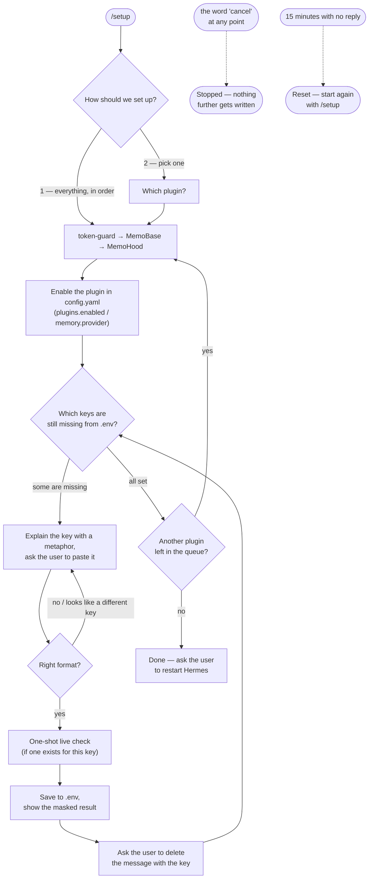

<h1 align="center">🧭 hermes-setup</h1>
<p align="center"><b>hermes-setup is a wizard plugin for hermes-agent: it enables and configures the other plugins (token-guard, MemoBase, MemoHood) right from a Telegram chat or the CLI — step by step, one question at a time, in plain language.</b></p>

<p align="center">
  <a href="LICENSE"></a>
  <a href="#installation"></a>
  <a href="#installation">=0.18" src="https://img.shields.io/badge/hermes--agent-%3E%3D0.18-blueviolet"></a>
  <a href="tests"></a>
  <a href="README.md"></a>
</p>

<p align="center">
  <a href="#quickstart">Quickstart</a> ·
  <a href="#commands">Commands</a> ·
  <a href="#faq">FAQ</a> ·
  <a href="README.md">Русский</a> ·
  <a href="https://skorehood.com">skorehood.com</a> ·
  <a href="https://www.youtube.com/@MaximSkorohood">YouTube</a>
</p>

---

## What does hermes-setup do?

Picture three new gadgets (token-guard, MemoBase, MemoHood), each with its own manual, its own plugs, and its own key-shaped wires that need to be hooked up correctly. hermes-setup is the technician who shows up and wires it all for you: asks one question at a time, explains what and why in plain words, checks every wire before it gets plugged in, and tells you when it's safe to flip the switch.

Technically, it's a [hermes-agent](https://github.com/NousResearch/hermes-agent) plugin that: (1) enables the right plugin in `config.yaml`, (2) asks for and saves only the API keys that are actually still missing, and (3) wherever possible, verifies a key with a single live request and reports honestly whether it worked.

## Why a separate plugin just for setup?

MemoBase and token-guard need seven keys and zero keys respectively; MemoHood needs four, three of which overlap with MemoBase's own. Doing this by hand means opening `config.yaml` in an editor, remembering the exact `plugins.enabled` syntax, tracking down the right format for every key, and not confusing `CLOUDFLARE_ACCOUNT_ID` with `CLOUDFLARE_API_TOKEN` (two different keys from the same site) — with zero feedback if a key turns out to be wrong.

The special case is **MemoHood**. It's a memory provider: architecturally, it has no way to reach the chat at all until `memory.provider` in the config already points at it. In other words, MemoHood can't ask to be turned on itself — like a TV that can't switch itself on without a remote. hermes-setup is that remote: it's a general plugin that gets enabled manually exactly once, and from there on it can flip `memory.provider` to `memohood` on the user's behalf.

## How does it work?

The wizard is a state machine: it remembers which step you're on in the running process's memory (not a file — if Hermes restarts mid-setup, just type `/setup` again). One message, one question. Every key you send is checked against its expected format (and sometimes with a single live request to the provider) before it's ever saved.



## Quickstart

### Installation

Installation is pure file operations plus one line in `config.yaml` — no hermes CLI invocation needed. hermes-setup is the one plugin out of the four that has to be turned on by hand: it's the one that turns the rest on.

1. Copy the whole `hermes-setup` folder to `%LOCALAPPDATA%\hermes\plugins\hermes-setup`. Create the `plugins` folder first if it doesn't exist yet.
2. Open `%LOCALAPPDATA%\hermes\config.yaml` in any text editor and add `hermes-setup` to the `plugins.enabled` list:

   ```yaml
   plugins:
     enabled:
       - hermes-setup
   ```

3. Save the file and restart Hermes (including the Telegram gateway, if you run one).
4. In your Telegram chat with the bot (or a plain CLI session), type:

   ```
   /setup
   ```

   The wizard greets you and asks whether to configure everything in order or pick a single plugin.

### Installing the other plugins as files

hermes-setup configures **config** (`config.yaml` + `.env`) for token-guard, MemoBase, and MemoHood, but it doesn't copy their files for you — those plugin folders need to already be on disk before the next Hermes restart, or the config entry it writes won't have anything to activate. Copy them the same way as hermes-setup above:

- `token-guard` → `%LOCALAPPDATA%\hermes\plugins\token-guard`
- `MemoBase` → `%LOCALAPPDATA%\hermes\plugins\memobase`
- `MemoHood` → `%LOCALAPPDATA%\hermes\plugins\memohood`

If a plugin's folder isn't there yet, the wizard still lets you configure and save its keys ahead of time — it just adds a one-line heads-up about it.

## Commands

| Command | Where | What it does |
|---|---|---|
| `/setup` | Telegram (or another gateway platform) / CLI | Starts or continues the setup wizard. |
| `/setup <answer>` | CLI | A plain terminal has no per-message "chat" to track, so every next answer is passed as an argument: `/setup 1`, `/setup AIza...`, `/setup cancel`. |
| "cancel" / "stop" / "отмена" | at any point | Stops the wizard without saving the in-progress step. |
| "skip" (пропустить) | while asked for a key | Skips that one key without saving it — you can come back and configure it later via `/setup`. |

On Telegram (and other gateway platforms), after `/setup` you can just reply with plain text — the wizard recognizes it's talking to you until you type "cancel" or 15 minutes pass with no reply.

## Which plugins can it configure

| Plugin | What it is, in plain words | Keys needed |
|---|---|---|
| **token-guard** | Spend tracker: counts tokens and dollars on every request. | 0 — just needs enabling. |
| **MemoBase** | Your personal library: upload documents/videos, the plugin finds the right passage and answers with a citation. | 7 (Cloudflare, Cohere, Gemini, ScrapeCreators, Apify, Groq). |
| **MemoHood** | The agent's personal diary: remembers what matters from a conversation on its own and brings it up again later. A memory provider — activated via `memory.provider`, not `plugins.enabled`. | 4 (Cloudflare ×2, Cohere, Gemini — all already overlap with MemoBase's). |

If you've already set up MemoBase, you almost certainly won't have to re-enter any keys for MemoHood — the wizard checks what's already saved in `.env` and never asks for the same key twice.

## Keys and safety

- Every key is only ever shown in chat masked: the first 4 characters plus "…" — e.g. `AIza…`. The full key never ends up in a log, an error message, or back in the chat.
- Keys are saved strictly to `HERMES_HOME/.env` — never to `config.yaml`, never into the model's conversation history.
- After a key is saved, the wizard asks you to delete the message that contained it — safer in case anyone else can see that chat, or if it's logged automatically somewhere.
- Every key's format is checked before it's saved: if a key looks like it belongs to a DIFFERENT service (say, you pasted a Gemini key where a Groq key was expected), the wizard politely re-asks for the key it actually needs.
- Wherever possible — Cloudflare, Cohere, Gemini, Groq, Apify — a single live request runs right after saving, to honestly report "the key works" or "the server returned an error."
- `config.yaml` writes (`plugins.enabled`, `memory.provider`, `memory.memohood.*`) only ever go through the standard `hermes_cli.config` API — never a hand-rolled file edit, never a bypass of the normal mechanism.

## FAQ

**Do I have to set up all three plugins at once?**
No. Right at the start, the wizard asks — "everything in order" or "pick one." You can configure just what you need right now and come back for the rest later via `/setup`.

**What happens if I paste a bad key?**
The wizard explains what's wrong (empty value, wrong format, or it looks like a key for a different service) and re-asks for the exact same key — nothing breaks or gets lost.

**What if I don't want to hand over a particular key right now?**
Type "skip" (пропустить) — the wizard moves on to the next step. Whatever plugin needed that key just won't be able to use the matching feature until you finish setting it up later via `/setup`.

**What if I change my mind partway through?**
Type "cancel" (or "stop"/"отмена") at any point — the wizard stops immediately, doesn't write anything further, and everything already saved up to that point stays exactly as it is.

**The wizard timed out — I didn't answer for 20 minutes. Now what?**
It resets itself automatically after 15 minutes of silence and asks you to start again with `/setup`. Anything you'd already configured before the pause is already saved — you won't have to start from zero.

**Why doesn't the wizard install the plugin files itself?**
Because that's a file operation outside of what a hermes plugin is allowed to do (plugins don't modify other plugins or run installer scripts) — hermes-setup configures the config and the keys; copying a folder is the same manual step it takes for hermes-setup itself.

**Do I need to install any dependencies?**
No. General-purpose (non-bundled) hermes plugins don't support `pip_dependencies`, so all of hermes-setup's code is stdlib Python.

## What are the limitations?

- Wizard state lives only in the running process's memory — restarting Hermes mid-setup resets the current step (but not anything already saved to `config.yaml`/`.env`). Start over with `/setup`.
- `discover_plugin_dirs` is a hint, not a hard gate: even if a plugin's folder hasn't been copied to disk yet, the wizard still lets you configure and save its keys ahead of time.
- The live key check is one-shot, no retries, 15-second timeout: on a network error or timeout the wizard honestly says "couldn't verify," but the key is saved regardless — the check is diagnostic, not a save gate.
- `set_config_value`/`save_config` can fail if a specific config key is locked by managed configuration (e.g. a corporate/NixOS build) — the wizard catches that exception instead of crashing, but it also won't be able to auto-enable the plugin in that case; API keys still get saved either way.
- In a CLI session (unlike Telegram), every answer has to be passed as a command argument — `/setup <answer>` — rather than just the next plain message. That's how hermes's plugin API for the command line (`register_command`) is built: it has no notion of a "chat" and doesn't retain incoming messages between calls.

## What and why

### Why in-memory state, not a file?

MemoBase deliberately persists its own wizard's state to a file (`wizard_state.json`) — because that one covers a long operation (a first document ingest) that would be a shame to lose on a restart. hermes-setup's flow is shorter and more linear: a handful of questions in a row, usually in one sitting. A file would add risk (what if the state's shape changes between plugin versions and a stale file is left on disk, now incompatible) with no real upside — restarting the wizard with `/setup` is cheaper than fixing a desynced state file.

### Why CLI and Telegram share the exact same step logic

`register_command` (CLI) gets no session/chat information at all — just the argument text. `pre_gateway_dispatch` (Telegram/gateway), by contrast, gets a `chat_id`/`user_id`, but doesn't exist outside a gateway. Rather than two parallel wizard implementations, both share one set of step functions, and the CLI path simply uses a fixed pseudo `chat_id` — a CLI session always has exactly one local operator, so there's no way it can collide with a real (numeric) Telegram `chat_id`.

### Why there's no blocking `input()` in the CLI command

It was tempting — in a real terminal, you could just call `input()` in a loop and get a "genuine" line-by-line conversation out of one command invocation. But `register_command`'s handler is documented to potentially run in a gateway context too, not only a plain CLI one — if for any reason `pre_gateway_dispatch` doesn't intercept a message first (say, it throws), that same command handler could get invoked inside the gateway process, where there's no interactive `stdin` at all, and a blocking `input()` would hang that gateway thread forever. So the CLI path is built just as safely as the Telegram one — `/setup <answer>` per call, no waiting on input inside the handler itself.

### Why `plugins.enabled` isn't written via `hermes plugins enable`

`hermes_cli/plugins_cmd.py` already has a function for this (`cmd_enable`) — but it's built for an interactive terminal: it prints through `rich.Console` and, in some cases, ASKS the user via `console.input(...)` whether to let the plugin override built-in tools. Calling it from a chat wizard would risk exactly the same blocking input problem described above. So the `plugins.enabled` list is appended to directly through `hermes_cli.config.load_config`/`save_config` — the same official API, just without the interactive-prompt layer on top of it.

## Documentation

The full wizard walkthrough — every step, every key, and troubleshooting — lives in [`skill/hermes-setup/references/guide.md`](skill/hermes-setup/references/guide.md). Implementation details and the full hermes plugin API contract live in [`API_CONTRACT_PLUGINS.md`](../../API_CONTRACT_PLUGINS.md) at the repository root.

## Tests

```
<venv>\python.exe -m pytest plugins/hermes-setup/tests -q -m "not integration"
```

Locally: **77 passed**, 0 failed. Every test is fully isolated: `HERMES_HOME` is swapped for a temp directory (a dedicated guard fixture asserts the real `config.yaml`/`.env` is never touched), and every live key-check HTTP call (`registry._http_get`) is mocked — the suite never actually calls Cloudflare/Gemini/Groq/Cohere/Apify.

## Made by

Built by **Maxim Vasko** — [skorehood.com](https://skorehood.com) · [YouTube](https://www.youtube.com/@MaximSkorohood)

## License

MIT — copyright © 2026 Maxim Vasko. Full text in [`LICENSE`](LICENSE).
