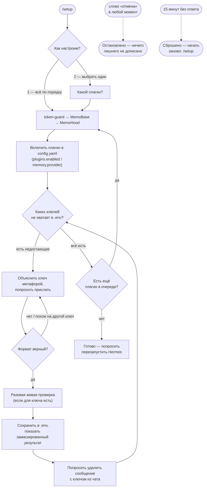

<h1 align="center">🧭 hermes-setup</h1>
<p align="center"><b>hermes-setup — это плагин-мастер для hermes-agent: включает и настраивает остальные плагины (token-guard, MemoBase, MemoHood) прямо из чата в Telegram или из CLI — по шагам, один вопрос за раз, простым языком.</b></p>

<p align="center">
  <a href="LICENSE"></a>
  <a href="#установка"></a>
  <a href="#установка">=0.18" src="https://img.shields.io/badge/hermes--agent-%3E%3D0.18-blueviolet"></a>
  <a href="tests"></a>
  <a href="README.en.md"></a>
</p>

<p align="center">
  <a href="#быстрый-старт">Быстрый старт</a> ·
  <a href="#команды">Команды</a> ·
  <a href="#частые-вопросы">FAQ</a> ·
  <a href="README.en.md">English</a> ·
  <a href="https://skorehood.com">skorehood.com</a> ·
  <a href="https://www.youtube.com/@MaximSkorohood">YouTube</a>
</p>

---

## Что делает hermes-setup?

Представьте, что у вас есть три новых устройства (token-guard, MemoBase, MemoHood), и у каждого — своя инструкция, свои разъёмы и свои провода-ключи, которые нужно правильно подключить. hermes-setup — это мастер, который приходит и подключает всё это за вас: спрашивает по одному вопросу, объясняет простыми словами, что и зачем, проверяет каждый провод перед подключением и говорит, когда можно нажимать кнопку "включить".

Технически это [hermes-agent](https://github.com/NousResearch/hermes-agent)-плагин, который: (1) включает нужный плагин в `config.yaml`, (2) спрашивает и сохраняет только те ключи API, которых ещё не хватает, (3) там, где можно — проверяет ключ одним живым запросом и честно говорит, сработал он или нет.

## Зачем отдельный плагин для настройки?

У MemoBase и token-guard — семь и ноль ключей соответственно, у MemoHood — четыре, и три из них совпадают с ключами MemoBase. Ручная настройка — это открыть `config.yaml` в редакторе, вспомнить синтаксис `plugins.enabled`, найти нужный формат для каждого ключа, не перепутать `CLOUDFLARE_ACCOUNT_ID` с `CLOUDFLARE_API_TOKEN` (это два разных ключа с одного сайта) — и всё это без единой подсказки, если ключ не подошёл.

Особый случай — **MemoHood**. Это провайдер памяти: у него архитектурно нет доступа к чату, пока `memory.provider` в конфиге не указывает на него. Другими словами, MemoHood не может сама попросить себя включить — как телевизор без пульта не может включиться сам. hermes-setup — это тот самый пульт: он общий плагин, включается один раз вручную, и дальше умеет переключить `memory.provider` на `memohood` за пользователя.

## Как это работает?

Мастер — это конечный автомат: он помнит, на каком вы шаге, в оперативной памяти процесса (не в файле — если Hermes перезапустится посреди настройки, просто наберите `/setup` заново). Одно сообщение — один вопрос. Каждый присланный ключ проверяется по формату (а иногда и одним живым запросом к серверу) прежде, чем сохраниться в `.env`.



## Быстрый старт

### Установка

Установка — это только файловые операции и одна строчка в `config.yaml`, без запуска hermes CLI. hermes-setup — единственный из четырёх плагинов, который приходится включать вручную: он и есть тот, кто включает остальные.

1. Скопируйте всю папку `hermes-setup` в `%LOCALAPPDATA%\hermes\plugins\hermes-setup`. Если папки `plugins` там ещё нет — создайте её.
2. Откройте `%LOCALAPPDATA%\hermes\config.yaml` в любом текстовом редакторе и добавьте `hermes-setup` в список `plugins.enabled`:

   ```yaml
   plugins:
     enabled:
       - hermes-setup
   ```

3. Сохраните файл и перезапустите Hermes (в том числе шлюз Telegram, если он у вас настроен).
4. В Telegram-чате с ботом (или в обычном CLI-сеансе) наберите:

   ```
   /setup
   ```

   Мастер поздоровается и спросит, настроить всё по порядку или выбрать один плагин.

### Установка остальных плагинов файлами

hermes-setup настраивает **конфиг** (`config.yaml` + `.env`) для token-guard, MemoBase и MemoHood, но не копирует их файлы за вас — папки этих плагинов должны быть на диске до перезапуска Hermes, иначе включённая запись в конфиге ничего не подхватит. Скопируйте их так же, как hermes-setup выше:

- `token-guard` → `%LOCALAPPDATA%\hermes\plugins\token-guard`
- `MemoBase` → `%LOCALAPPDATA%\hermes\plugins\memobase`
- `MemoHood` → `%LOCALAPPDATA%\hermes\plugins\memohood`

Если папки плагина ещё нет, мастер всё равно даст настроить и сохранить ключи заранее — просто предупредит об этом одной строкой.

## Команды

| Команда | Где | Что делает |
|---|---|---|
| `/setup` | Telegram (или другая платформа-шлюз) / CLI | Запускает или продолжает мастер настройки. |
| `/setup <ответ>` | CLI | В обычном терминале нет отдельного «чата» для каждого сообщения — поэтому каждый следующий ответ передаётся аргументом: `/setup 1`, `/setup AIza...`, `/setup отмена`. |
| «отмена» / «стоп» / «cancel» | в любой момент | Останавливает мастер без сохранения текущего шага. |
| «пропустить» | во время вопроса про ключ | Пропускает конкретный ключ, не сохраняя его — можно вернуться и настроить позже через `/setup`. |

В Telegram (и на других платформах-шлюзах) после `/setup` достаточно просто отвечать текстом — мастер сам поймёт, что вы отвечаете именно ему, пока не наберёте «отмена» или не пройдёт 15 минут без ответа.

## Какие плагины умеет настраивать

| Плагин | Что это, простыми словами | Ключей нужно |
|---|---|---|
| **token-guard** | Счётчик расходов: считает токены и деньги на каждый запрос. | 0 — только включение. |
| **MemoBase** | Личная библиотека: загружаете документы/видео, плагин находит нужный кусок и отвечает с цитатой. | 7 (Cloudflare, Cohere, Gemini, ScrapeCreators, Apify, Groq). |
| **MemoHood** | Личный дневник агента: сам запоминает важное из разговора и подсказывает это в следующий раз. Провайдер памяти — включается через `memory.provider`, а не `plugins.enabled`. | 4 (Cloudflare ×2, Cohere, Gemini — все уже пересекаются с MemoBase). |

Если вы уже настроили MemoBase, для MemoHood почти наверняка не придётся вводить ключи заново — мастер сам видит, какие уже сохранены в `.env`, и не спрашивает их повторно.

## Ключи и безопасность

- Каждый ключ показывается в чате только замаскированным: первые 4 символа + «…» — например `AIza…`. Полный ключ никогда не попадает в лог, в текст ошибки или обратно в чат.
- Ключи сохраняются строго в `HERMES_HOME/.env` — не в `config.yaml`, не в истории диалога модели.
- После сохранения ключа мастер просит удалить сообщение, в котором вы его прислали — так безопаснее, если чат кто-то ещё видит или если в нём есть автоматическое логирование.
- Формат каждого ключа проверяется до сохранения: если ключ выглядит так, будто это ключ от ДРУГОГО сервиса (например, вы вставили Gemini-ключ туда, где ждали Groq), мастер вежливо переспросит именно тот ключ, который нужен.
- Там, где возможно — Cloudflare, Cohere, Gemini, Groq, Apify — сразу после сохранения выполняется один живой запрос к серверу, чтобы честно сказать: «ключ действителен» или «сервер ответил ошибкой».
- Настройки `config.yaml` (`plugins.enabled`, `memory.provider`, `memory.memohood.*`) пишутся только через штатный `hermes_cli.config` — не руками, не мимо стандартного механизма.

## Частые вопросы

**Обязательно ли настраивать все три плагина сразу?**
Нет. При запуске мастер сразу спрашивает — «всё по порядку» или «выбрать один». Можно настроить только то, что нужно сейчас, и вернуться позже за остальным через `/setup`.

**Что будет, если я пришлю неверный ключ?**
Мастер объяснит, что не так (пустое значение, не тот формат, или похоже на ключ от другого сервиса), и переспросит тот же самый ключ ещё раз — ничего не сломается и не потеряется.

**А если я не хочу давать какой-то ключ прямо сейчас?**
Напишите «пропустить» — мастер перейдёт к следующему шагу. Плагин, которому не хватает ключа, просто не сможет использовать соответствующую возможность, пока вы не донастроите его через `/setup` позже.

**Что если я передумаю на середине настройки?**
Напишите «отмена» (или «стоп»/«cancel») в любой момент — мастер остановится, ничего лишнего не допишет, всё уже сохранённое до этого момента останется как есть.

**Мастер завис, я 20 минут не отвечал — что теперь?**
Мастер сам сбрасывается через 15 минут без ответа и просит начать заново командой `/setup`. Всё, что вы успели настроить до паузы, уже сохранено — начинать с нуля не придётся.

**Почему мастер не устанавливает файлы плагинов сам?**
Потому что это уже файловая операция за пределами того, что позволено плагину hermes (плагины не модифицируют другие плагины и не запускают установочные скрипты) — hermes-setup настраивает конфиг и ключи, а копирование папки — такой же ручной шаг, как для самого hermes-setup.

**Нужно ли устанавливать какие-то зависимости?**
Нет. Обычные (не bundled) плагины hermes не поддерживают `pip_dependencies`, поэтому весь код hermes-setup написан на стандартной библиотеке Python.

## Какие есть ограничения?

- Состояние мастера хранится только в памяти процесса — перезапуск Hermes посреди настройки сбрасывает текущий шаг (но не то, что уже сохранено в `config.yaml`/`.env`). Начать заново — `/setup`.
- `discover_plugin_dirs` — это подсказка, а не жёсткая проверка: даже если папка плагина ещё не скопирована на диск, мастер всё равно даст настроить и сохранить его ключи заранее.
- Живая проверка ключа — разовая, без повторов, с таймаутом 15 секунд: при сетевой ошибке или таймауте мастер честно скажет «не удалось проверить», но ключ всё равно сохранится (проверка — это диагностика, а не условие сохранения).
- `set_config_value`/`save_config` могут отказать, если конкретный ключ конфига заблокирован managed-конфигурацией (например, корпоративная/NixOS-сборка) — мастер ловит это исключение и не падает, но и не сможет включить плагин автоматически в этом случае; ключи API при этом всё равно сохранятся.
- В CLI-сеансе (в отличие от Telegram) каждый ответ приходится передавать аргументом команды: `/setup <ответ>`, а не просто следующим сообщением — так устроен API плагинов hermes для командной строки (`register_command`), у него нет привязки к «чату» и не сохраняются входящие сообщения между вызовами.

## Что и почему сделано

### Почему состояние — в памяти, а не в файле?

MemoBase намеренно хранит состояние своего мастера в файле (`wizard_state.json`) — потому что там речь о долгой операции (первая загрузка документов), которую жалко терять при перезапуске. У hermes-setup сценарий короче и линейнее: несколько вопросов подряд, обычно за одну сессию. Файл добавил бы риск («а что если структура состояния изменится между версиями плагина, а старый файл на диске останется несовместимым») без реальной выгоды — перезапустить мастер командой `/setup` дешевле, чем чинить рассинхронизацию файла состояния.

### Почему CLI и Telegram делят одну и ту же логику шагов

`register_command` (CLI) не получает вообще никакой информации о «сессии» или «чате» — только текст аргументов. `pre_gateway_dispatch` (Telegram/шлюз), наоборот, получает `chat_id`/`user_id`, но не существует вне шлюза. Вместо двух параллельных реализаций мастера у обоих один и тот же набор функций-шагов, а CLI-путь просто использует фиксированный псевдо-`chat_id` — в CLI-сеансе всегда ровно один локальный оператор, так что коллизий с настоящими (числовыми) `chat_id` из Telegram быть не может.

### Почему нет блокирующего `input()` в CLI-команде

Соблазн был — в реальном терминале можно было бы просто звать `input()` в цикле и получить «настоящий» построчный диалог за один вызов команды. Но `register_command`'s handler по документированному контракту может быть вызван и в gateway-контексте тоже (а не только в чистом CLI) — если по любой причине `pre_gateway_dispatch` не перехватит сообщение первым (например, само упадёт с исключением), тот же самый обработчик команды может быть вызван внутри процесса шлюза, где никакого интерактивного `stdin` нет и блокирующий `input()` просто подвесил бы этот поток шлюза навсегда. Поэтому CLI-путь устроен так же безопасно, как и Telegram — `/setup <ответ>` за один вызов, без ожидания ввода внутри самого обработчика.

### Почему `plugins.enabled` пишется не через `hermes plugins enable`

У `hermes_cli/plugins_cmd.py` уже есть готовая функция для этого (`cmd_enable`) — но она рассчитана на интерактивный терминал: печатает через `rich.Console` и в определённых случаях СПРАШИВАЕТ пользователя через `console.input(...)`, разрешить ли плагину переопределять встроенные инструменты. Вызвать её из чат-мастера означало бы рискнуть тем же самым блокирующим вводом, которого мы избежали абзацем выше. Поэтому список `plugins.enabled` дополняется напрямую через `hermes_cli.config.load_config`/`save_config` — то есть тем же самым официальным API, но без слоя интерактивных подсказок поверх него.

## Документация

Полная методичка мастера — разбор каждого шага, все ключи и диагностика неполадок — в [`skill/hermes-setup/references/guide.md`](skill/hermes-setup/references/guide.md). Инженерные детали и полный контракт плагинов hermes — в [`API_CONTRACT_PLUGINS.md`](../../API_CONTRACT_PLUGINS.md) в корне репозитория.

## Тесты

```
<venv>\python.exe -m pytest plugins/hermes-setup/tests -q -m "not integration"
```

Локально: **77 passed**, 0 упавших. Все тесты полностью изолированы: `HERMES_HOME` подменяется на временную папку (отдельный guard-фикстюр проверяет, что реальные `config.yaml`/`.env` тест не трогает), а живые HTTP-проверки ключей (`registry._http_get`) везде замоканы — тесты никогда не стучатся в настоящие Cloudflare/Gemini/Groq/Cohere/Apify.

## Made by

Сделано **Maxim Vasko** — [skorehood.com](https://skorehood.com) · [YouTube](https://www.youtube.com/@MaximSkorohood)

## Лицензия

MIT — copyright © 2026 Maxim Vasko. Полный текст — в [`LICENSE`](LICENSE).
