<h1 align="center">🧠 MemoHood</h1>
<p align="center"><b>MemoHood is a dialogue-memory plugin for hermes-agent: the agent notices what matters in a conversation on its own, recalls it at the right moment next time, and decides on its own when an old fact needs replacing — without a single extra command from you.</b></p>

<p align="center">
  <a href="LICENSE"></a>
  <a href="#quickstart"></a>
  <a href="#quickstart">=0.18" src="https://img.shields.io/badge/hermes--agent-%3E%3D0.18-blueviolet"></a>
  <a href="tests/"></a>
  <a href="README.md"></a>
</p>

<p align="center">
  <a href="#quickstart">Quickstart</a> ·
  <a href="#tools-and-commands">Tools & commands</a> ·
  <a href="#settings">Settings</a> ·
  <a href="#faq">FAQ</a> ·
  <a href="README.md">Русский</a> ·
  <a href="https://skorehood.com">skorehood.com</a> ·
  <a href="https://www.youtube.com/@MaximSkorohood">YouTube</a> ·
  <a href="https://t.me/+XrhmiKgCQdY5MjFi">Telegram</a>
</p>

---

## What is MemoHood?

MemoHood is a dialogue-memory plugin for [hermes-agent](https://github.com/NousResearch/hermes-agent). Think of it as giving the agent a personal diary: it writes down what matters from a conversation — facts, decisions, corrections, preferences — on its own, and glances back at that diary before every new reply, without you ever having to ask it to remember anything.

Without memory, an agent only knows what fits in the current conversation context: start a new session and everything from yesterday is gone. MemoHood stores what matters separately, in a local database on your own machine, and blends the relevant pieces back into the conversation exactly when they'd be useful. It's a memory provider (`memory.provider`) — only one such provider is active at a time — but MemoHood coexists happily with [MemoBase](../hermes-kb/) (your document knowledge base): they're different systems, and the `recall_all` tool can query both at once.

## What you get

- **Auto-recall before every reply.** Before the agent starts answering, MemoHood quietly searches memory for anything relevant: hybrid search combines full-text FTS5/BM25 with Russian stemming and vector search (the BGE-M3 model via Cloudflare Workers AI), fuses both result lists with Reciprocal Rank Fusion (RRF), and, if a key is configured, reranks the top candidates with Cohere.
- **Auto-capture that's free wherever possible.** Explicit signals — a correction, a decision, a preference, an outright "remember this" — are caught by a free keyword-signal scorer, no LLM call involved. Only genuinely borderline cases go to a single call to the cheap Gemini flash-lite model, which decides whether it's worth remembering and how.
- **Supersede instead of overwriting history.** When a new fact contradicts an old one (the user changed their mind, corrected themselves), MemoHood doesn't keep both side by side — the new one replaces the old, and the old one isn't lost: it moves into the record's dated history, retrievable any time via `memohood_fetch`.
- **Pinned facts that never get forgotten.** A name, a birthday, an allergy, a diagnosis, an explicit "remember this forever" — these are recognized and marked as pinned. Pinned records are fully excluded from the nightly confidence decay, no matter how much time passes.
- **Nightly consolidation with an Ebbinghaus forgetting curve.** Each fact's confidence decays exponentially with time since it was last accessed — fast for fleeting events, much slower for durable facts and beliefs, and not at all for pinned records. All of this heavy lifting (decay, dedup, day→week→month rollup, index rebuild) runs off the reply's hot path, as a background nightly job.
- **Russian morphology out of the box.** Both queries and stored records are stemmed with PyStemmer — a query for "договора" finds a record about "договор," no exact word-form match required.
- **recall_all — memory and knowledge base together.** One tool searches both dialogue memory and MemoBase (if installed) at once, prioritizing fresher memory records over stale documents on the same topic.
- **A spend ledger with a monthly ceiling.** Every external call — embedding, reranking, LLM extraction — is logged to a spend ledger. Once a provider's monthly ceiling is hit, that step is quietly skipped (e.g., search runs without the vector leg) instead of raising an error.

### New in v1.1 — a smarter recall pipeline

Three stages make recall sharper and more varied. Two are on by default, the third is opt-in.

- **`gate` — "is this even worth recalling?" (off by default).** Before spending on a full search, the gate can quickly judge the query: if it's a plain "thanks" or "ok," recall is skipped. The default is `gate.backend: pass` — the gate always lets the turn through (memory is checked every turn). Turn on the smart mode with `gate.backend: model2vec`: a tiny offline static-embedding model (the `model2vec` package, no network, no API key) compares the query against built-in "looks like a memory question" and "looks like small talk" seed sets. The rule is deliberately cautious: recall is skipped only when small-talk signals clearly win — a false recall is safer than a false silence.
- **`post_recall` — variety, no duplicates (ON by default).** After search, the result set goes through two steps: near-duplicate collapsing (two nearly identical records don't take up two slots) and MMR (Maximal Marginal Relevance) — reordering so the top results aren't all about the same thing. The upshot: the agent sees a broader, less redundant slice of memory.
- **`graph_rerank` — links between sessions (ON by default).** MemoHood keeps a graph of links between sessions (`session_links`). If a retrieved record belongs to a session linked to the top "anchor" results, its weight is nudged up; on top of that, relevant records from linked sessions can be pulled in that plain search missed. This surfaces context-related material, not just literal word matches.

## How does it work?

```mermaid
flowchart LR
    subgraph TURN["Every conversation turn"]
        MSG["User message"]
        GATE{"gate — recall?<br/>v1.1, default pass"}
        PRE["hybrid search<br/>FTS5 (RU stemming) + BGE-M3 vector + RRF + Cohere rerank"]
        GR["graph_rerank<br/>session links, v1.1"]
        POST["post_recall<br/>MMR + duplicate collapsing, v1.1"]
        CTX["&lt;memory-context&gt; in the prompt"]
        ANS["Model's reply"]
        MSG --> GATE -->|"recall"| PRE --> GR --> POST --> CTX --> ANS
        GATE -.->|"skip"| ANS
    end

    ANS --> SYNC["sync_turn<br/>background thread, reply doesn't wait"]

    subgraph CAPTURE["capture.py — two-stage extraction"]
        SIG{"Free keyword signals"}
        GEM["Gemini flash-lite<br/>borderline cases only"]
        SUP{"supersede classifier<br/>cosine + LLM judge"}
        SIG -->|"clear signal"| SUP
        SIG -->|"borderline"| GEM --> SUP
    end

    SYNC --> SIG
    SUP -->|"ADD / SUPERSEDE / NOOP"| DB[("memory.db<br/>captures + supersede history")]

    DB -.->|"nightly, via hermes cron"| NIGHT["Consolidation:<br/>Ebbinghaus decay (pinned exempt) →<br/>dedup → day→week→month rollup → FTS rebuild"]
    NIGHT -.-> DB
```

Every conversation turn goes through a prefetch step — and it's a whole pipeline: `gate` decides whether to recall at all → hybrid search (FTS5 + vector + RRF + optional Cohere) pulls candidates → `graph_rerank` lifts context-linked records via the session graph → `post_recall` drops duplicates and adds variety. MemoHood blends the result into the prompt as a separate `<memory-context>` block. Once the model has replied, a background thread (never blocking the reply) runs `sync_turn`: it breaks the turn down into signals, calls Gemini on the borderline cases when needed, and decides whether to add a new record, replace an old one (supersede), or do nothing (duplicate). Overnight, on a `hermes cron` schedule, a separate consolidation pass runs: confidence decay, dedup, rolling up old records, and rebuilding the index.



## MemoHood vs the alternatives

| Criterion | MemoHood | No memory (system prompt only) | MemoBase (document knowledge base) |
|---|---|---|---|
| What it remembers | Dialogue: facts, decisions, corrections, preferences | Only the current session's context | Uploaded documents, not conversations |
| Forgetting | Gradual, on an Ebbinghaus curve; pinned records — never | Total, on a new session or context compaction | Not applicable, documents don't decay |
| Contradicting facts | Supersede: the new one replaces the old, the old moves to history | Pile up in context, confuse the model | Not applicable |
| Cost | Fractions of a cent per turn; $5/month default ceiling per provider | Zero | Fractions of a cent per question (embed + rerank) |
| Compatibility | Works alongside MemoBase via `recall_all` | — | Works alongside MemoHood |

## Quickstart

### Installation

1. Copy the whole plugin folder into `~/.hermes/plugins/memohood/` (on Windows: `%LOCALAPPDATA%\hermes\plugins\memohood\`). The folder name on disk must be exactly `memohood` — that's how hermes locates the memory provider.
2. Open `config.yaml` and set MemoHood as the memory provider:

   ```yaml
   memory:
     provider: memohood
   ```

3. Add the needed keys to the `.env` file next to `config.yaml` (`~/.hermes/.env`, on Windows `%LOCALAPPDATA%\hermes\.env`). The easiest way is the terminal onboarding wizard:

   ```
   hermes memohood setup
   ```

   It walks you through one question at a time, and any step can be skipped with a plain Enter (memory keeps working, just more modestly): first Cloudflare (embeddings — vector search by meaning), then Cohere — explaining in plain language what a reranker is (a strict editor that resorts what was found so the most useful result lands on top), then Gemini (borderline-fact extraction and nightly consolidation), and finally a check that the needed python libraries are present. Each key can optionally be verified with a single live request to the provider. A key is never shown in full on the console — only its first few characters plus an ellipsis — and it's written to `.env` in that same masked form. The wizard doesn't touch `config.yaml`: `memory.provider: memohood` from step 2 above is still something you set yourself (or run `hermes-setup` once and configure MemoHood entirely from Telegram — see the FAQ below).

   The same keys the wizard asks for one by one can also be filled in by hand:

   ```
   CLOUDFLARE_ACCOUNT_ID=...
   CLOUDFLARE_API_TOKEN=...
   GEMINI_API_KEY=...
   COHERE_API_KEY=...   # optional — enables the final rerank step
   ```

   Cloudflare powers vector search (embeddings, on the free tier), Gemini handles borderline-fact extraction and nightly consolidation, Cohere is an optional rerank step. See the FAQ below for what happens if a key is missing.

4. No need to install dependencies (`sqlite-vec`, `PyStemmer`, `ftfy`, `requests`) by hand: unlike general-purpose hermes plugins, memory providers can install their own pip dependencies automatically on activation.
5. Restart hermes and check:

   ```
   hermes memohood status
   ```

   If the plugin loaded correctly, you'll see memory stats (empty for now) and the 30-day spend against the configured ceiling for each provider, at 0.

## Settings

Every key below is set in `config.yaml` under the `memory.memohood.` prefix, e.g. `memory.memohood.capture_threshold: 4.0`.

| Key | Type | Default | What it does |
|---|---|---|---|
| `gate.backend` | string | `pass` | The "should we recall?" gate in front of recall. `pass` — always recall (default); `model2vec` — offline query-relevance classifier (opt-in, pulls in the `model2vec` package) |
| `gate.threshold` | float | `0.5` | Confident "don't recall" threshold for the `model2vec` backend |
| `gate.margin` | float | `0.05` | Bias toward recall: skip only when negative signals clearly win |
| `gate.model2vec_model` | string | `minishlab/potion-base-8M` | Static embedding model used by the gate |
| `gate.meaningful_terms_floor` | int | `3` | If the query has this many meaningful words or more, recall immediately, no embedding needed |
| `model.provider` | string | `gemini` | LLM provider used for borderline fact extraction and nightly consolidation |
| `model.model` | string | `gemini-2.5-flash-lite` | The specific model used for extraction and consolidation |
| `embedder.provider` | string | `cloudflare` | Embedding provider for the vector search leg |
| `embedder.model` | string | `@cf/baai/bge-m3` | Embedding model |
| `embedder.dims` | int | `1024` | Vector dimensionality |
| `rerank.provider` | string | `cohere` | Final rerank provider |
| `rerank.enabled` | bool | `true` | Enable Cohere rerank on top of the RRF result (degrades silently to rrf-only without a key) |
| `post_recall.mmr.enabled` | bool | `true` | MMR diversity on the recall set — top results aren't all about the same thing |
| `post_recall.mmr.lambda` | float | `0.7` | Relevance/diversity balance (`1.0` = pure relevance) |
| `post_recall.cluster.enabled` | bool | `true` | Collapse near-duplicates in the result set |
| `post_recall.cluster.threshold` | float | `0.93` | Cosine threshold above which two records count as duplicates |
| `graph_rerank.enabled` | bool | `true` | Rerank by the graph of session links (`session_links`) |
| `graph_rerank.boost` | list | `[1.5, 1.3, 1.15]` | Score multipliers by link closeness (tight/medium/loose) |
| `graph_rerank.max_neighbors` | int | `3` | Max linked records to pull into the result set |
| `graph_rerank.top_n_anchors` | int | `3` | How many top results act as "anchors" for graph expansion |
| `graph_rerank.weight_tiers` | list | `[0.66, 0.33]` | Link-weight thresholds that pick the boost tier |
| `auto_capture` | bool | `true` | Automatically extract facts from every conversation turn |
| `capture_threshold` | float | `4.0` | Free keyword-signal score above which a fact is captured with certainty, no LLM call needed |
| `monthly_ceiling_usd.cloudflare` | number | `5` | Monthly spend ceiling for embeddings, $ |
| `monthly_ceiling_usd.cohere` | number | `5` | Monthly spend ceiling for reranking, $ |
| `monthly_ceiling_usd.gemini` | number | `5` | Monthly spend ceiling for extraction and consolidation, $ |
| `decay.floor` | float | `0.05` | Confidence threshold below which a record is archived during nightly consolidation |
| `decay.halflife_days.event` | int | `7` | Half-life for events |
| `decay.halflife_days.preference` | int | `90` | For preferences |
| `decay.halflife_days.decision` | int | `90` | For decisions |
| `decay.halflife_days.correction` | int | `90` | For corrections |
| `decay.halflife_days.fact` | int | `365` | For durable facts |
| `decay.halflife_days.persona` | int | `365` | For identity/profile data |
| `decay.halflife_days.instruction` | int | `365` | For instructions |
| `decay.halflife_days.summary` | int | `365` | For summaries produced by consolidation |
| `recall.k` | int | `8` | How many memory records to return in prefetch on every turn |
| `recall.messages_k` | int | `4` | How many history messages to return in prefetch |
| `consolidate.enabled` | bool | `true` | Enable the rollup step during nightly consolidation |

## Tools and commands

The model sees memory as six tools; a human sees it as `hermes memohood` commands.

### Tools (available to the model)

| Tool | Parameters | What it does |
|---|---|---|
| `memohood_search` | `query` (required), `k` (default 8) | Raw search over memory records, unformatted (not the usual recall block) — a list of hits with id, kind, score, and source |
| `memohood_fetch` | `capture_id` (required) | A single memory record by id, including its supersede history |
| `memohood_recall` | `query` (required), `k` (default 10) | Explicitly recall facts and dialogue history for a query — the same thing that happens automatically before every turn, but on demand and with a custom k |
| `memohood_stats` | — | Memory statistics: record count, breakdown by kind, 30-day spend per provider, history-indexing state |
| `memohood_capture` | `content` (required), `kind` (persona/event/preference/decision/correction/fact/instruction), `pinned` (bool) | Explicitly save a fact, bypassing auto-extraction — for when the user directly asks to remember something |
| `recall_all` | `query` (required), `k` (default 6) | Search both dialogue memory and the MemoBase knowledge base (if installed) at once, prioritizing fresher memory records |

### CLI commands

| Command | What it does |
|---|---|
| `hermes memohood status` / `hermes memohood stats` | Memory statistics (same as `memohood_stats`): record count, breakdown by kind, 30-day spend per provider, history-indexing state |
| `hermes memohood reindex` | Re-embed all records into a shadow table — needed after changing the embedding model |
| `hermes memohood seed [--dry-run]` | Catch the dialogue-history full-text index up to the current state — indexing for recall only, this does not extract new facts from old history; `--dry-run` shows the index state without changing anything |
| `hermes memohood consolidate` | Manually run nightly consolidation (confidence decay, dedup, rollup, index rebuild) — normally scheduled via `hermes cron`; this command is for a manual run or debugging |

## Usage example

You don't call anything specially — memory works on its own. A telling three-session scenario:

**Monday, you mention something important in passing:**

> — By the way, I'm allergic to penicillin, remember that.
> — Noted, I'll keep it in mind.

The explicit signals "remember" and "allergic" pass the free keyword-signal scorer — the fact is saved with no LLM call, as `kind: fact`, and marked `pinned` (an allergy is one of the pinned triggers).

**A month later, in a new session:**

> — Suggest an antibiotic for a sore throat.
> — Given your penicillin allergy, the penicillin family is out — here are alternatives…

Before replying, `gate` decided recall was worth it; hybrid search found the pinned fact (a month on, it hasn't decayed — pinned records are exempt from decay), `graph_rerank` and `post_recall` tidied the result set, and the fact was blended into `<memory-context>`. You reminded it of nothing.

**Later you change your mind:**

> — Actually, no allergy — the doctor revised the diagnosis.
> — Got it, updating.

The signal "actually" plus a contradiction with the old record triggers supersede: the new record replaces the old one, the old one moves into dated history (still visible via `memohood_fetch`) and no longer surfaces in normal search.

## What are the limitations?

- `hermes memohood seed` populates the history index for recall, but it does **not** extract new facts from old history — two-stage extraction only runs for new turns after installation.
- `recall_all` doesn't yet reconcile freshness across sources for the same entity: if memory and MemoBase return conflicting answers, both come back sorted by relevance, not by date — check each result's source tag.
- There's no explicit "forget this fact" tool: a wrong record gets fixed by asking the agent to remember the correct version — it replaces the old one via supersede, and the old one only survives in the record's dated history, no longer surfacing in normal search.
- Cost estimates for external calls are a best-effort approximation from the providers' public pricing, not a guaranteed exact bill.

## FAQ

**How is MemoHood different from the MemoBase knowledge base?**
MemoBase stores and searches *your documents* (PDFs, DOCX files, web pages) with verified verbatim citations. MemoHood stores and searches *dialogue history* — facts, decisions, and preferences mentioned in conversation. They're different systems running in parallel: the `recall_all` tool can query both at once and tags each result with its source.

**Will MemoHood forget something important?**
Ordinary facts gradually lose weight on an Ebbinghaus curve and eventually get archived (not deleted, just stop surfacing in search). But facts marked as pinned — a name, a birthday, an allergy, a diagnosis, an explicit "remember this forever" — are fully excluded from that decay and stay relevant indefinitely.

**What happens without GEMINI_API_KEY?**
Borderline-fact extraction and nightly consolidation simply won't run — the plugin doesn't crash or take the session down with it, but borderline (non-obvious) facts stop getting captured, and decay/rollup won't run automatically. Explicit signals (keywords like "remember this," "we decided," "actually") keep getting captured for free, no LLM involved.

**How much does this cost?**
Fractions of a cent. By default, the monthly ceiling is $5 for each of the three providers (Cloudflare, Gemini, Cohere) separately, and that's a ceiling, not a typical spend — a normal session uses a small fraction of it. If a provider's ceiling is hit, the plugin doesn't crash — that step (say, reranking) is just quietly skipped. Current spend is visible in `hermes memohood status`.

**What does `hermes memohood setup` do?**
It's a terminal onboarding wizard: one question per step, collecting the Cloudflare, Cohere, and Gemini keys, explaining in plain language what each one gives you (Cohere is the reranker — a strict editor that resorts what was found so the most useful result lands on top), optionally verifying each key with a live request, and saving them to `.env` in masked form — a key is never shown in full on the console. Enter on any step skips it. The wizard doesn't touch `memory.provider` or the `memory.memohood` section in `config.yaml` — that's still the manual step 2 from Quickstart above.

**What's the easiest way to set up MemoHood if I'm new to hermes?**
Enable the `hermes-setup` plugin once (add it to `plugins.enabled`) and send `/setup` in Telegram — it walks through and configures every plugin in order, in plain language, including MemoHood, and it's the one that flips `memory.provider` to `memohood` in the config for you. MemoHood is a special case: it has no chat access until it's the active memory provider, which is exactly why that first switch normally goes through `hermes-setup` or a manual edit. If you don't need Telegram and just want to collect the keys from a terminal, use `hermes memohood setup` directly (see Quickstart above).

**Does memory survive a hermes upgrade?**
Yes. MemoHood is a plugin, living in `~/.hermes/plugins/memohood/`, separate from the hermes-agent core code — core upgrades don't touch it.

**Does MemoHood support Russian?**
Yes, that's one of the plugin's design goals: both queries and stored records are stemmed with PyStemmer, aware of Russian morphology — a query for "договора" finds a record about "договор" without an exact word-form match.

**Does MemoHood slow the agent down?**
Recall (prefetch) happens before the reply and adds search time; fact capture (`sync_turn`) runs in a background thread after the reply is already shown to the user, and doesn't delay it. Nightly consolidation runs on its own schedule, separate from the conversation.

## Tests

Unit and component tests (including dedicated suites for `gate`, `post_recall`, `graph_rerank`, and the end-to-end v1.1 pipeline) run like this — from a neutral directory, not inside the plugin folder:

```
python -m pytest tests -q -m "not integration"
```

At publication time: **180 passed** (2 integration tests excluded by `-m "not integration"` — they require live API keys).

## Documentation

A practical guide to installation, diagnostics, and how fact capture works is in [`GUIDE.md`](GUIDE.md) (Russian). The full engineering spec is in [`DESIGN_v1.md`](DESIGN_v1.md). The hermes skill lives in [`skill/memohood/SKILL.md`](skill/memohood/SKILL.md).

## Made by

Built by **Maxim Vasko** — [skorehood.com](https://skorehood.com) · [YouTube](https://www.youtube.com/@MaximSkorohood) · [Telegram](https://t.me/+XrhmiKgCQdY5MjFi)

## License

MIT — copyright © 2026 Maxim Vasko. Full text in [`LICENSE`](LICENSE).
