<h1 align="center">🧠 MemoHood</h1>
<p align="center"><b>MemoHood — это плагин памяти диалогов для hermes-agent: агент сам замечает важное в разговоре, сам вспоминает его к месту в следующий раз и сам решает, когда старый факт пора заменить новым — без единой лишней команды от вас.</b></p>

<p align="center">
  <a href="LICENSE"></a>
  <a href="#быстрый-старт"></a>
  <a href="#быстрый-старт">=0.18" src="https://img.shields.io/badge/hermes--agent-%3E%3D0.18-blueviolet"></a>
  <a href="tests/"></a>
  <a href="README.en.md"></a>
</p>

<p align="center">
  <a href="#быстрый-старт">Быстрый старт</a> ·
  <a href="#инструменты-и-команды">Инструменты и команды</a> ·
  <a href="#настройки">Настройки</a> ·
  <a href="#частые-вопросы">FAQ</a> ·
  <a href="README.en.md">English</a> ·
  <a href="https://skorehood.com">skorehood.com</a> ·
  <a href="https://www.youtube.com/@MaximSkorohood">YouTube</a>
</p>

---

## Что делает MemoHood?

MemoHood — это плагин памяти диалогов для [hermes-agent](https://github.com/NousResearch/hermes-agent). Представьте, что у агента появился личный дневник: он сам записывает туда важное из разговора — факты, решения, исправления, предпочтения — и сам подглядывает в него перед каждым новым ответом, без того, чтобы вы отдельно просили что-то запомнить.

Без памяти агент помнит только то, что помещается в текущий контекст: начали новую сессию — и всё, что было вчера, исчезло. MemoHood хранит важное отдельно, в локальной базе на вашей машине, и подмешивает нужные кусочки обратно в разговор ровно тогда, когда они пригодились бы. Это провайдер памяти (`memory.provider`) — в один момент времени активен один такой провайдер, но MemoHood прекрасно уживается с [MemoBase](../hermes-kb/) (базой знаний по вашим документам): это разные системы, и инструмент `recall_all` умеет спрашивать обе сразу.

## Что это даёт

- **Авто-вспоминание перед каждым ответом.** Перед тем как агент начнёт отвечать, MemoHood тихо ищет в памяти всё релевантное: гибридный поиск объединяет полнотекстовый FTS5/BM25 с русским стеммингом и векторный поиск (модель BGE-M3 через Cloudflare Workers AI), сливает оба списка взаимным ранжированием (RRF) и, если настроен ключ, дополнительно переранжирует топ-кандидатов моделью Cohere.
- **Авто-захват фактов, бесплатный там, где можно.** Явные сигналы — исправление, решение, предпочтение, прямое «запомни» — ловятся бесплатным сигнальным скорингом по ключевым словам, без единого вызова LLM. Только по-настоящему спорные случаи уходят на один-единственный вызов дешёвой модели Gemini flash-lite, которая решает, стоит ли это запоминать и как.
- **Supersede вместо затирания истории.** Когда новый факт противоречит старому (пользователь передумал, поправил себя), MemoHood не хранит оба вперемешку — новый замещает старый, а старый не пропадает: уходит в датированную историю записи, которую всегда можно поднять через `memohood_fetch`.
- **Pinned-факты, которые никогда не забываются.** Имя, дата рождения, аллергии, диагнозы, явное «запомни навсегда» — распознаются и помечаются как pinned. Такие записи полностью исключены из ночного угасания confidence, сколько бы времени ни прошло.
- **Ночная консолидация с кривой забывания Эббингауза.** Уверенность (confidence) каждого факта угасает экспоненциально со временем с момента последнего обращения к нему — быстрее для мимолётных событий, гораздо медленнее для устойчивых фактов и убеждений, и вообще не угасает для pinned. Вся эта тяжёлая работа (decay, дедуп, свёртка день→неделя→месяц, перестройка индекса) вынесена из горячего пути ответа в фоновую ночную задачу.
- **Русская морфология из коробки.** И запросы, и содержимое записей стеммингуются PyStemmer — запрос «договора» находит запись про «договор», без точного совпадения форм слова.
- **recall_all — память и база знаний вместе.** Один инструмент ищет сразу и в памяти диалогов, и в MemoBase (если она установлена), с приоритетом более свежих записей памяти над устаревшими документами по той же теме.
- **Спенд-леджер с месячным потолком.** Каждый внешний вызов — эмбеддинг, реранк, экстракция LLM — пишется в леджер расходов. При достижении месячного потолка по конкретному провайдеру соответствующий шаг просто аккуратно пропускается (например, поиск идёт без векторного плеча), а не падает с ошибкой.

### Новое в v1.1 — умный конвейер recall

Три этапа делают вспоминание точнее и разнообразнее. Два из них включены по умолчанию, третий — opt-in.

- **`gate` — «стоит ли вообще вспоминать?» (по умолчанию выключен).** Перед тем как тратиться на полный поиск, гейт может быстро оценить запрос: если это простое «спасибо» или «ок», recall пропускается. По умолчанию `gate.backend: pass` — гейт всегда пропускает дальше (память проверяется каждый ход). Включить умный режим — `gate.backend: model2vec`: крошечная офлайн-модель статических эмбеддингов (пакет `model2vec`, без сети и без API-ключа) сравнивает запрос со встроенными наборами «похоже на вопрос к памяти» и «похоже на болтовню». Правило намеренно осторожное: пропуск recall только при явном перевесе «болтовни» — ложно вспомнить безопаснее, чем ложно промолчать.
- **`post_recall` — разнообразие и без дублей (по умолчанию ВКЛ).** После поиска выдача проходит два шага: схлопывание near-дублей (две почти одинаковые записи не занимают два места) и MMR (Maximal Marginal Relevance) — переупорядочивание так, чтобы верхние результаты не были все об одном и том же. Итог: агент видит более широкую и менее избыточную картину памяти.
- **`graph_rerank` — связи между сессиями (по умолчанию ВКЛ).** MemoHood хранит граф связей между сессиями (`session_links`). Если найденная запись относится к сессии, связанной с «якорными» топ-результатами, её вес немного повышается; кроме того, из связанных сессий могут подтянуться релевантные записи, которые обычный поиск не нашёл. Так по теме поднимается контекстно-связанное, а не только буквально совпавшее по словам.

## Как это работает?

```mermaid
flowchart LR
    subgraph TURN["Каждый ход диалога"]
        MSG["Сообщение пользователя"]
        GATE{"gate — вспоминать?<br/>v1.1, по умолч. pass"}
        PRE["гибридный поиск<br/>FTS5(RU-стемминг) + вектор BGE-M3 + RRF + Cohere rerank"]
        GR["graph_rerank<br/>связи сессий, v1.1"]
        POST["post_recall<br/>MMR + схлопывание дублей, v1.1"]
        CTX["&lt;memory-context&gt; в промпте"]
        ANS["Ответ модели"]
        MSG --> GATE -->|"recall"| PRE --> GR --> POST --> CTX --> ANS
        GATE -.->|"skip"| ANS
    end

    ANS --> SYNC["sync_turn<br/>фоновый поток, ответ не ждёт"]

    subgraph CAPTURE["capture.py — двухступенчатая экстракция"]
        SIG{"Бесплатные сигналы-ключевики"}
        GEM["Gemini flash-lite<br/>только спорные случаи"]
        SUP{"supersede-классификатор<br/>cosine + LLM-judge"}
        SIG -->|"явный сигнал"| SUP
        SIG -->|"спорно"| GEM --> SUP
    end

    SYNC --> SIG
    SUP -->|"ADD / SUPERSEDE / NOOP"| DB[("memory.db<br/>captures + история замещений")]

    DB -.->|"ночью, hermes cron"| NIGHT["Консолидация:<br/>decay Эббингауза (кроме pinned) →<br/>dedup → rollup день→неделя→месяц → FTS-rebuild"]
    NIGHT -.-> DB
```

Каждый ход диалога проходит через prefetch, и это целый конвейер: `gate` решает, стоит ли вообще вспоминать → гибридный поиск (FTS5 + вектор + RRF + опц. Cohere) достаёт кандидатов → `graph_rerank` поднимает контекстно-связанное по графу сессий → `post_recall` убирает дубли и добавляет разнообразия. Итог MemoHood подмешивает в промпт отдельным блоком `<memory-context>`. После того как модель ответила, в фоновом потоке (не блокируя ответ) запускается `sync_turn`: он разбирает реплику на сигналы, при необходимости зовёт Gemini на спорные случаи и решает — добавить новую запись, заменить старую (supersede) или ничего не делать (дубль). Ночью, по расписанию `hermes cron`, отдельно запускается консолидация: угасание confidence, дедуп, свёртка старых записей и перестройка индекса.



## MemoHood vs альтернативы

| Критерий | MemoHood | Без памяти (только system prompt) | MemoBase (база знаний по документам) |
|---|---|---|---|
| Что помнит | Диалоги: факты, решения, исправления, предпочтения | Только текущий контекст сессии | Загруженные документы, не диалоги |
| Забывание | Плавное, по кривой Эббингауза; pinned — никогда | Полное при новой сессии или сжатии контекста | Не применимо, документы не угасают |
| Противоречивые факты | Supersede: новое замещает старое, старое — в историю | Копятся в контексте, модель путается | Не применимо |
| Стоимость | Доли цента за ход; месячный потолок по умолчанию $5 на провайдера | Ноль | Доли цента за вопрос (эмбеддинг + реранк) |
| Совместимость | Работает вместе с MemoBase через `recall_all` | — | Работает вместе с MemoHood |

## Быстрый старт

### Установка

1. Скопируйте всю папку плагина в `~/.hermes/plugins/memohood/` (на Windows: `%LOCALAPPDATA%\hermes\plugins\memohood\`). Имя папки на диске должно быть именно `memohood` — по нему hermes находит провайдер памяти.
2. Откройте `config.yaml` и укажите MemoHood как провайдер памяти:

   ```yaml
   memory:
     provider: memohood
   ```

3. Впишите нужные ключи в `.env` рядом с `config.yaml` (`~/.hermes/.env`, на Windows — `%LOCALAPPDATA%\hermes\.env`). Проще всего это сделать мастером настройки прямо в терминале:

   ```
   hermes memohood setup
   ```

   Мастер идёт по шагам, по одному вопросу за раз, и каждый можно пропустить простым Enter (память продолжит работать, просто скромнее): сначала Cloudflare (эмбеддинги — векторный поиск по смыслу), потом Cohere — и тут же простыми словами объясняет, что такое реранкер («строгий редактор», который пересортировывает найденное так, что самое нужное оказывается сверху), затем Gemini (экстракция спорных фактов и ночная консолидация), и напоследок проверяет, что нужные python-библиотеки на месте. По желанию каждый ключ можно сразу проверить одним живым запросом к провайдеру. В консоли ключ целиком никогда не показывается — только первые символы с многоточием — и в таком же замаскированном виде пишется в `.env`. Мастер не трогает `config.yaml`: `memory.provider: memohood` из шага 2 выше по-прежнему нужно выставить самим (или один раз включить `hermes-setup` и настроить MemoHood целиком из Telegram — см. FAQ ниже).

   Ключи те же самые, что мастер спрашивает по одному, можно вписать и вручную:

   ```
   CLOUDFLARE_ACCOUNT_ID=...
   CLOUDFLARE_API_TOKEN=...
   GEMINI_API_KEY=...
   COHERE_API_KEY=...   # опционально — включает финальный реранк
   ```

   Cloudflare нужен для векторного поиска (эмбеддинги, бесплатный тир), Gemini — для экстракции спорных фактов и ночной консолидации, Cohere — необязательный реранк. Что произойдёт, если какого-то ключа нет — см. FAQ ниже.

4. Ставить зависимости (`sqlite-vec`, `PyStemmer`, `ftfy`, `requests`) руками не нужно: в отличие от обычных плагинов hermes, провайдеры памяти умеют доставить свои pip-зависимости сами при активации.
5. Перезапустите hermes и проверьте:

   ```
   hermes memohood status
   ```

   Если плагин подхватился, вы увидите статистику памяти (пока пустую) и расход за 30 дней по каждому провайдеру — 0 из настроенного потолка.

## Настройки

Все ключи ниже задаются в `config.yaml` с префиксом `memory.memohood.`, например `memory.memohood.capture_threshold: 4.0`.

| Ключ | Тип | По умолчанию | Что делает |
|---|---|---|---|
| `gate.backend` | string | `pass` | Гейт «стоит ли вспоминать» перед recall. `pass` — всегда вспоминать (по умолчанию); `model2vec` — офлайн-классификатор релевантности запроса (opt-in, подтягивает пакет `model2vec`) |
| `gate.threshold` | float | `0.5` | Порог уверенного «не вспоминать» для backend `model2vec` |
| `gate.margin` | float | `0.05` | Зазор в пользу recall: пропустить только при явном перевесе negative-сигналов |
| `gate.model2vec_model` | string | `minishlab/potion-base-8M` | Статическая embedding-модель для гейта |
| `gate.meaningful_terms_floor` | int | `3` | Если в запросе столько значимых слов и больше — вспоминаем сразу, без эмбеддинга |
| `model.provider` | string | `gemini` | Провайдер LLM для спорной экстракции фактов и ночной консолидации |
| `model.model` | string | `gemini-2.5-flash-lite` | Конкретная модель для экстракции и консолидации |
| `embedder.provider` | string | `cloudflare` | Провайдер эмбеддингов для векторного поиска |
| `embedder.model` | string | `@cf/baai/bge-m3` | Модель эмбеддингов |
| `embedder.dims` | int | `1024` | Размерность вектора |
| `rerank.provider` | string | `cohere` | Провайдер финального реранка |
| `rerank.enabled` | bool | `true` | Включить реранк Cohere поверх результата RRF (без ключа — тихая деградация в rrf-only) |
| `post_recall.mmr.enabled` | bool | `true` | MMR-разнообразие выдачи recall — верхние результаты не про одно и то же |
| `post_recall.mmr.lambda` | float | `0.7` | Баланс релевантность/разнообразие (`1.0` = чистая релевантность) |
| `post_recall.cluster.enabled` | bool | `true` | Схлопывать near-дубли в выдаче |
| `post_recall.cluster.threshold` | float | `0.93` | Косинусный порог, выше которого две записи считаются дублем |
| `graph_rerank.enabled` | bool | `true` | Переранжирование по графу связей сессий (`session_links`) |
| `graph_rerank.boost` | list | `[1.5, 1.3, 1.15]` | Множители score по близости связи (тесная/средняя/слабая) |
| `graph_rerank.max_neighbors` | int | `3` | Сколько связанных записей максимум подтянуть в выдачу |
| `graph_rerank.top_n_anchors` | int | `3` | Сколько верхних результатов служат «якорями» для расширения по графу |
| `graph_rerank.weight_tiers` | list | `[0.66, 0.33]` | Пороги веса связи для выбора тира boost |
| `auto_capture` | bool | `true` | Автоматически извлекать факты из каждого хода диалога |
| `capture_threshold` | float | `4.0` | Порог бесплатного сигнального скоринга, выше которого факт сохраняется гарантированно, без вызова LLM |
| `monthly_ceiling_usd.cloudflare` | number | `5` | Месячный потолок расходов на эмбеддинги, $ |
| `monthly_ceiling_usd.cohere` | number | `5` | Месячный потолок расходов на реранк, $ |
| `monthly_ceiling_usd.gemini` | number | `5` | Месячный потолок расходов на экстракцию и консолидацию, $ |
| `decay.floor` | float | `0.05` | Порог confidence, ниже которого запись архивируется при ночной консолидации |
| `decay.halflife_days.event` | int | `7` | Период полураспада для событий |
| `decay.halflife_days.preference` | int | `90` | Для предпочтений |
| `decay.halflife_days.decision` | int | `90` | Для решений |
| `decay.halflife_days.correction` | int | `90` | Для исправлений |
| `decay.halflife_days.fact` | int | `365` | Для устойчивых фактов |
| `decay.halflife_days.persona` | int | `365` | Для данных о личности/профиле |
| `decay.halflife_days.instruction` | int | `365` | Для инструкций |
| `decay.halflife_days.summary` | int | `365` | Для сводок, созданных консолидацией |
| `recall.k` | int | `8` | Сколько записей памяти возвращать в prefetch перед каждым ходом |
| `recall.messages_k` | int | `4` | Сколько сообщений истории возвращать в prefetch |
| `consolidate.enabled` | bool | `true` | Включить этап свёртки (rollup) при ночной консолидации |

## Инструменты и команды

Модель видит память как шесть инструментов; человек — как команды `hermes memohood`.

### Инструменты (доступны модели)

| Инструмент | Параметры | Что делает |
|---|---|---|
| `memohood_search` | `query` (обязателен), `k` (по умолчанию 8) | Сырой поиск по записям памяти без форматирования под обычный recall-блок — список найденных записей с id, типом, оценкой и источником |
| `memohood_fetch` | `capture_id` (обязателен) | Одна запись памяти по id вместе с историей замещений (supersede) |
| `memohood_recall` | `query` (обязателен), `k` (по умолчанию 10) | Явно вспомнить факты и историю диалогов по запросу — то же самое, что автоматическое вспоминание перед каждым ходом, но по требованию и с произвольным k |
| `memohood_stats` | — | Статистика памяти: сколько записей, разбивка по типам, расход за 30 дней по каждому провайдеру, состояние индексации истории |
| `memohood_capture` | `content` (обязателен), `kind` (persona/event/preference/decision/correction/fact/instruction), `pinned` (да/нет) | Явно сохранить факт в обход авто-извлечения — когда пользователь прямо просит что-то запомнить |
| `recall_all` | `query` (обязателен), `k` (по умолчанию 6) | Поиск сразу и по памяти диалогов, и по базе знаний MemoBase (если она установлена), с приоритетом более свежих записей памяти |

### CLI-команды

| Команда | Что делает |
|---|---|
| `hermes memohood status` / `hermes memohood stats` | Статистика памяти (то же самое, что `memohood_stats`): число записей, разбивка по типам, расход за 30 дней по каждому провайдеру, состояние индексации истории |
| `hermes memohood reindex` | Переэмбеддинг всех записей в теневую таблицу — нужен после смены модели эмбеддингов |
| `hermes memohood seed [--dry-run]` | Догнать полнотекстовый индекс истории диалогов до текущего состояния — только индексация для recall, извлечение новых фактов из старой истории этим не выполняется; `--dry-run` показывает состояние индекса, ничего не меняя |
| `hermes memohood consolidate` | Вручную запустить ночную консолидацию (угасание confidence, дедуп, свёртка, перестройка индекса) — обычно она идёт по расписанию через `hermes cron`, эта команда для ручного прогона или отладки |

## Пример использования

Ничего специально вызывать не нужно — память работает сама. Показательный сценарий из трёх сессий:

**Понедельник, вы вскользь упоминаете важное:**

> — Кстати, у меня аллергия на пенициллин, запомни.
> — Записал, учту.

Явные сигналы «запомни» и «аллергия» проходят бесплатный сигнальный скоринг — факт сохраняется без единого вызова LLM, `kind: fact`, и помечается `pinned` (аллергия — один из pinned-триггеров).

**Через месяц, в новой сессии:**

> — Подбери антибиотик от ангины.
> — Учитывая вашу аллергию на пенициллин, пенициллиновый ряд не подойдёт — вот альтернативы…

Перед ответом `gate` решил, что вспоминать стоит; гибридный поиск нашёл pinned-факт (за месяц он не угас — pinned исключены из decay), `graph_rerank` и `post_recall` привели выдачу в порядок, и факт подмешался в `<memory-context>`. Вы ни о чём не напоминали.

**Позже вы передумали:**

> — На самом деле аллергии нет, врач пересмотрел диагноз.
> — Понял, обновляю.

Сигнал «на самом деле» + противоречие старой записи запускают supersede: новая запись замещает старую, старая уходит в датированную историю (её всё ещё видно через `memohood_fetch`) и больше не всплывает в обычном поиске.

## Какие есть ограничения?

- `hermes memohood seed` наполняет индекс истории для поиска, но **не** извлекает из старой истории новые факты — двухступенчатая экстракция работает только для новых ходов диалога, идущих после установки.
- `recall_all` пока не примиряет свежесть результатов из разных источников по одной и той же сущности: если память и MemoBase выдают противоречащие друг другу ответы, вернутся оба, отсортированные по релевантности, а не по дате — читайте пометки источника у каждого результата.
- Явного инструмента «забыть факт» нет: неверную запись исправляют, попросив агента запомнить верную версию — она вытеснит старую через supersede, а старая останется только в датированной истории, не всплывая в обычном поиске.
- Оценки расходов по внешним вызовам — лучшее приближение по публичному прайсингу провайдеров, не гарантированно точный биллинг.

## Частые вопросы

**Чем MemoHood отличается от базы знаний MemoBase?**
MemoBase хранит и ищет по *вашим документам* (PDF, DOCX, сайты) с дословными проверенными цитатами. MemoHood хранит и ищет по *истории диалогов* — фактам, решениям, предпочтениям, которые вы или агент упомянули в разговоре. Это разные системы, работающие параллельно: инструмент `recall_all` умеет спрашивать обе сразу и метит каждый результат источником.

**Забудет ли MemoHood что-то важное?**
Обычные факты со временем плавно теряют вес по кривой Эббингауза и в конце концов архивируются (не удаляются физически, просто перестают всплывать в поиске). Но факты, помеченные как pinned — имя, дата рождения, аллергии, диагнозы, явное «запомни навсегда» — полностью исключены из этого угасания и остаются актуальными сколько угодно долго.

**Что будет, если не задать GEMINI_API_KEY?**
Экстракция спорных фактов и ночная консолидация просто не будут выполняться — плагин не упадёт и не уронит сессию, но пограничные (неочевидные) факты перестанут запоминаться, а угасание/свёртка не будут прогоняться автоматически. Явные сигналы (ключевые слова вроде «запомни», «решили», «на самом деле») продолжат запоминаться бесплатно, без LLM.

**Сколько это стоит?**
Копейки. По умолчанию месячный потолок — $5 на каждый из трёх провайдеров (Cloudflare, Gemini, Cohere) отдельно, и это именно потолок, а не типичный расход: обычная сессия использует малую его часть. При достижении потолка по конкретному провайдеру плагин не падает — соответствующий шаг (например, реранк) просто тихо пропускается. Текущий расход — в `hermes memohood status`.

**Что делает `hermes memohood setup`?**
Это мастер онбординга прямо в терминале: по одному вопросу за шаг собирает ключи Cloudflare, Cohere и Gemini, объясняет простыми словами, что каждый из них даёт (Cohere — это реранкер, «строгий редактор», пересортировывающий найденное так, что самое нужное оказывается сверху), по желанию проверяет каждый ключ живым запросом и сохраняет их в `.env` в замаскированном виде — целиком ключ в консоли не показывается никогда. Enter на любом шаге — пропустить. `memory.provider` и секцию `memory.memohood` в `config.yaml` мастер не трогает, это по-прежнему ручной шаг 2 из «Быстрого старта» выше.

**Какой самый простой способ настроить MemoHood, если я только начинаю с hermes?**
Включите один раз плагин `hermes-setup` (добавьте его в `plugins.enabled`) и отправьте `/setup` в Telegram — он по порядку объяснит и настроит все плагины, включая MemoHood, простыми словами, а заодно сам переключит `memory.provider` на `memohood` в конфиге. MemoHood — особый случай: у неё нет доступа к чату, пока она не станет активным провайдером памяти, поэтому первое включение всегда идёт через `hermes-setup` или вручную. Если Telegram не нужен и вы просто хотите собрать ключи из терминала — используйте `hermes memohood setup` напрямую (см. «Быстрый старт» выше).

**Переживёт ли память обновление hermes?**
Да. MemoHood — плагин, лежит в `~/.hermes/plugins/memohood/` отдельно от кода самого hermes-agent, и обновления ядра его не затрагивают.

**Поддерживает ли MemoHood русский язык?**
Да, это одна из целей плагина: и запросы, и содержимое записей стеммингуются PyStemmer с учётом русской морфологии — запрос «договора» находит запись про «договор» без точного совпадения форм слова.

**Замедляет ли MemoHood ответы агента?**
Вспоминание (prefetch) идёт перед ответом и добавляет время на поиск; захват фактов (`sync_turn`) выполняется в фоновом потоке после того, как ответ уже показан пользователю, и не задерживает его. Ночная консолидация идёт по расписанию отдельно от диалога.

## Тесты

Юнит- и компонентные тесты (включая отдельные наборы на `gate`, `post_recall`, `graph_rerank` и сквозной конвейер v1.1) прогоняются так — из нейтрального каталога, не изнутри папки плагина:

```
python -m pytest tests -q -m "not integration"
```

На момент публикации: **180 passed** (2 интеграционных теста исключены флагом `-m "not integration"` — они требуют живых API-ключей).

## Документация

Практический гайд по установке, диагностике и работе с захватом фактов — в [`GUIDE.md`](GUIDE.md). Полная инженерная спецификация — в [`DESIGN_v1.md`](DESIGN_v1.md). Скилл для hermes — в [`skill/memohood/SKILL.md`](skill/memohood/SKILL.md).

## Made by

Сделано **Maxim Vasko** — [skorehood.com](https://skorehood.com) · [YouTube](https://www.youtube.com/@MaximSkorohood)

## Лицензия

MIT — copyright © 2026 Maxim Vasko. Полный текст — в [`LICENSE`](LICENSE).
