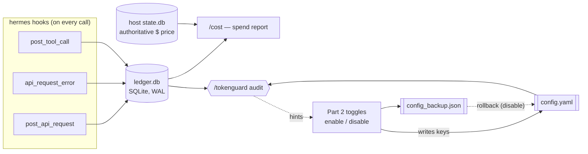

<h1 align="center">🛡️ token-guard</h1>
<p align="center"><b>token-guard is a hermes-agent plugin that tracks your token spend in a local SQLite ledger and, only when you explicitly opt in, saves money on auxiliary calls — without touching the main model's quality.</b></p>

<p align="center">
  <a href="LICENSE"></a>
  <a href="#installation"></a>
  <a href="#installation">=0.18" src="https://img.shields.io/badge/hermes--agent-%3E%3D0.18-blueviolet"></a>
  <a href="tests/test_plugin.py"></a>
  <a href="README.md"></a>
</p>

<p align="center">
  <a href="#quickstart">Quickstart</a> ·
  <a href="#commands">Commands</a> ·
  <a href="#faq">FAQ</a> ·
  <a href="README.md">Русский</a> ·
  <a href="https://skorehood.com">skorehood.com</a> ·
  <a href="https://www.youtube.com/@MaximSkorohood">YouTube</a>
</p>

---

## What is token-guard?

token-guard is a plugin for [hermes-agent](https://github.com/NousResearch/hermes-agent) that does two things: it honestly shows you where your tokens and dollars are going in every session, and — only with your explicit sign-off — it turns on specific, reversible ways to save money on the model's auxiliary (non-primary) calls.

It's built as two independent parts. **Part 1** — the ledger, the cache guard, and the audit — runs passively and **never changes model behavior**; it just watches. **Part 2** — three savings toggles — is off by default, and only turns on after you've seen a "savings → risk → safeguard" card and confirmed explicitly; every toggle rolls back with a single command at any time.

## What you get

- **Per-request cost tracking.** Every model call, error, and tool call is written to a local SQLite ledger: how many tokens (input, output, cache-read, cache-write, reasoning), which model, which session. The `/cost` command turns that into a report for any time window.
- **A cache guard.** The plugin catches the moment a model or provider changes mid-session — that invalidates the prompt cache, so the next request goes through at full price instead of the discounted one. `/cost` also shows the cache hit-rate so you can see when something's off.
- **Audits based on real usage, not guesses.** `/tokenguard audit` checks your config against the ledger: for example, "this toolset is enabled but hasn't been called in 14+ days" is a fact pulled from the ledger, not a guess.
- **Up to −40–60% on auxiliary calls via the Part 2 toggles** — this is an estimate based on external evidence (industry benchmarks, see "What was built and why" below), not a guarantee and not something the plugin proves on its own ahead of time. Every toggle requires an explicit confirmation before it turns on, and can be rolled back with one command at any time; the actual effect then shows up in `/cost`.

Important: what the plugin observes and counts (Part 1) **never changes model behavior** — it's just a ledger and reports. Only the Part 2 toggles save money, and they're off by default.

## How does it work?

Part 1 works passively: hermes hooks fire on every API call, error, and tool call, writing one row each into `ledger.db`. The `/cost` command reads token counts from that ledger and dollar amounts from hermes's own database (`state.db`), so it doesn't need to maintain its own pricing table. `/tokenguard audit` compares `config.yaml` against the ledger and returns a list of hints (it never edits anything itself). Part 2 (the toggles) edits a handful of `config.yaml` keys, first saving their old values into `config_backup.json` — that's also where the rollback comes from.



## Why not just edit the config by hand?

| Criterion | token-guard | Manual `config.yaml` edits | No token tracking at all |
|---|---|---|---|
| Visibility into spend by session and model | Yes — `/cost` | No | No |
| Hints grounded in actual usage, not memory | Yes — `/tokenguard audit` reads the ledger | No — you have to remember | No |
| Risk confirmation before turning on savings | "Savings → risk → safeguard" card | No, the edit applies immediately | — |
| Rollback | One command, byte-accurate backup | Manual, if you remembered to save the old value | — |
| Need to know hermes's dotted-key syntax | No | Yes | — |
| Setup cost | Copy a folder + one line in `config.yaml` | Read hermes's docs and get the key right | Zero, but also zero data |

## Quickstart

### Installation

Installation is plain file operations only — no hermes CLI calls involved.

1. Copy the whole `token-guard` folder into `%LOCALAPPDATA%\hermes\plugins\token-guard`. Create the `plugins` folder there first if it doesn't exist yet.
2. Open `%LOCALAPPDATA%\hermes\config.yaml` in any text editor and add `token-guard` to the `plugins.enabled` list. If the file has no `plugins:` section at all yet, add one:

   ```yaml
   plugins:
     enabled:
       - token-guard
   ```

3. Save the file. In your normal hermes session, run:

   ```
   /tokenguard status
   ```

   If the plugin loaded correctly, you'll see a list of toggles (all "disabled") and a hint to set a cheap model.

## Commands

| Command | What it does |
|---|---|
| `/cost [days]` | Spend report for a period (7 days by default): request count; tokens by bucket (input/output/cache-read/cache-write/reasoning); top 5 models by tokens with a $ estimate where pricing could be resolved; top 5 sessions by $ (price comes from hermes's own database — authoritative); cache hit-rate and cache-bust count; error count (including retried); list of active toggles. |
| `/tokenguard status` | Which toggles are on, which "cheap" model is configured. |
| `/tokenguard audit` | Run the configuration checks (see below) — changes nothing. |
| `/tokenguard enable <toggle>` | Show the "savings → risk → safeguard" risk card and ask you to repeat with `confirm`. |
| `/tokenguard enable <toggle> confirm` | Apply the toggle. |
| `/tokenguard disable <toggle>` | Roll the toggle back to its pre-enable state. |
| `/tokenguard set-cheap-model <provider> <model>` | Set the "cheap" model used by `cheap_aux` / `cheap_delegation` — neither toggle will enable without it. |
| `hermes token-guard cost\|status\|audit\|enable\|disable\|set-cheap-model ...` | The same commands from a terminal. |

### Audit (`/tokenguard audit`)

Nothing here is auto-applied — it's only hints, and each one is grounded in real ledger or config data:

1. `prompt_caching.cache_ttl` is unset or equal to `5m`, and the ledger shows more than one session — hints you to enable `cache_1h`.
2. `auxiliary.compression.model` is unset — summarization runs on the main (usually expensive) model. If it is set, the plugin best-effort compares its context window against the main model's; if the comparison isn't possible, it honestly says "check manually."
3. `delegation.model` is unset — hints you to enable `cheap_delegation`.
4. Enabled toolsets that haven't been used in 14+ days (per ledger data) — candidates for disabling, which would shrink the schema size of every request. token-guard **never disables** them itself, only names them.
5. Cross-checks `config_backup.json` against the current toggle registry — flags entries from unknown or stale toggles.

## What toggles are available (Part 2)?

All off by default. The risk card is shown before the first enable, always in the **savings → risk → safeguard** format.

| Toggle | Default | What it writes in `config.yaml` | Precondition |
|---|---|---|---|
| `cheap_aux` | off | `auxiliary.compression.model/provider`, `auxiliary.title_generation.model/provider` | a cheap model is set (`/tokenguard set-cheap-model`) |
| `cheap_delegation` | off | `delegation.model/provider` | a cheap model is set (`/tokenguard set-cheap-model`) |
| `cache_1h` | off | `prompt_caching.cache_ttl` → `"1h"` | none |
| `cron_cascade` | reserved | not implemented | — |
| `context_editing` | reserved | not implemented | — |

**`cheap_aux`** — a cheap model for context compression and session titles.
- Savings: summarization and titling are the most frequent auxiliary calls.
- Risk: a weak summary during compression loses detail permanently; a model with a short context window silently drops the middle of the conversation with no warning.
- Safeguard: pick a long-context "flash" model; `/tokenguard audit` checks the window size after enabling; rollback — `/tokenguard disable cheap_aux`.

**`cheap_delegation`** — a cheap model for subagents.
- Savings: up to −50% on delegated tasks (search, information gathering).
- Risk: deep reasoning inside a subagent can drop in quality.
- Safeguard: don't delegate heavy tasks, or disable the toggle; rollback — `/tokenguard disable cheap_delegation`.

**`cache_1h`** — a 1-hour prompt cache instead of 5 minutes.
- Savings: reading the cache costs ~10% of the regular price; the 1-hour window pays off when there are pauses between messages.
- Risk: writing to a 1-hour cache is more expensive (2× vs. 1.25× for the 5-minute one) — with very infrequent messages, the savings can wash out to zero.
- Safeguard: `/cost` shows the hit-rate; rollback — `/tokenguard disable cache_1h`.

**Reserved (not implemented yet):** `cron_cascade`, `context_editing` — the command replies "reserved, coming in a future version."

## What's next (roadmap v2)

These are plans, not dated promises — everything below is designed for, not yet shipped:

- **HTML reports for `/cost`** — the report is chat-only text today; v2 adds an export to a readable HTML file.
- **`cron_cascade`** — a toggle for scheduling a cascade of models over time (currently reserved; the command replies "coming in a future version").
- **`context_editing`** — a toggle for targeted context edits without rebuilding the whole prompt (currently reserved for the same reason).

## What was built and why

### Why a two-part architecture?

The requirement behind this plugin was simple: "savings without making the agent dumber." So observation (the ledger, the cache guard, the audit) and the risky savings levers are strictly separated: Part 1 cannot degrade model quality by construction, because it changes nothing — it only watches. Part 2 (`cheap_aux`, `cheap_delegation`, `cache_1h`) is a set of explicit, individually-enabled, reversible experiments under observation: each requires a two-step confirmation showing a "savings → risk → safeguard" card, writes a minimal `config.yaml` diff with a byte-accurate backup, and rolls back with one command. The effect of each experiment then shows up in `/cost`.

### Why is the ledger SQLite, and why aren't dollars computed in the hooks?

Hooks (`post_api_request`, `api_request_error`, `post_tool_call`) are called synchronously by hermes, right inside the agent's own run loop — so they must be fast and must never raise. That's why each handler is a single `INSERT` into SQLite (WAL mode), wrapped in `try/except`: a ledger failure must never take down a session. Dollar amounts are deliberately not computed inside the hooks — hermes itself prices usage and stores it in `sessions.estimated_cost_usd`; `/cost` reads that figure via `SessionDB(read_only=True)` (no write lock, and no separate pricing table that would inevitably drift from the host's). The hook's usage dict only carries token buckets — verified directly against hermes's own code, not assumed.

### Why are the toggles built the way they are?

Toggles write `config.yaml` keys through the standard `hermes_cli.config.set_config_value` (a safe dotted-key writer), not by hand. Building this surfaced three things that had to be worked around:

- `set_config_value` calls `sys.exit(1)` if a key is locked by managed configuration (e.g., NixOS builds). `SystemExit` is a `BaseException`, not an `Exception`, so a plain `except Exception` won't catch it. That's why `enable`/`disable`/`set-cheap-model` explicitly catch `(Exception, SystemExit)` around every `set_config_value` call — a managed key can never crash the whole hermes process; the user just gets a normal error message instead.
- The host has no primitive to **delete** a config key — only to write a value. So "roll back to the state where the key didn't exist at all" is hand-built: read the raw `config.yaml`, delete the dotted key while pruning now-empty parent dicts, and write it back directly (bypassing `save_config()`, which doesn't guarantee a byte-accurate rollback because it normalizes and strips defaults).
- In this version of hermes (0.18.0), `auxiliary.session_search.*` is dead config — the engine no longer reads it. So `cheap_aux` only touches `auxiliary.compression.*` and `auxiliary.title_generation.*`, not `session_search`, even though the original spec mentioned it too.

### Why these three toggles specifically — and not other levers?

Each toggle rests on a specific number or precedent, not a guess:

- **Caching** — reading from the cache costs roughly 10% of the regular input-token price (Anthropic pricing); at the same time, writing to a 1-hour cache is more expensive (2×) than writing to a 5-minute one (1.25×) — which is why the 1-hour option is a toggle with an explicit risk, not a default.
- **Tool schemas** — measured on stock hermes at roughly 21–26K tokens per request just for tool descriptions. This isn't a token-guard toggle (see below for why), but it's part of the evidence for why the audit checks unused toolsets at all.
- **Cheap models for subagents** — this isn't a hypothesis: Claude Code's own telemetry shows 36% of subagent calls running on Haiku, and 3-tier routing cuts session cost by −51%. `cheap_delegation` brings the same pattern to hermes.
- **The compression-model trap** — if the compression model's context window is smaller than the main model's, it silently drops the middle of the conversation with no summary at all. This is a documented risk in hermes's own docs, which is exactly why `/tokenguard audit` explicitly compares window sizes, and why the `cheap_aux` risk card calls this out directly.
- **What we deliberately did NOT rebuild**: lazy tool schemas and smart request routing (`smart_model_routing`) are built-in features already being developed upstream in hermes itself (PRs #53193, #58838, #59390). Duplicating them in a plugin would just create conflicts with upstream; once they're merged, `/tokenguard audit` will suggest turning them on.

### What environment constraints shaped the code?

General-purpose (non-bundled) hermes plugins have no `pip_dependencies` mechanism, so all the code here is stdlib-only Python (`sqlite3`, `json`, `threading`, `pathlib`, ...). Every "heavy" or host-internal import (`hermes_cli.config`, `agent.usage_pricing`, `agent.model_metadata`, `model_tools`, `hermes_state`) is deferred — imported inside functions, not at module scope — and wrapped so that if a host API is unavailable, the plugin just shows "n/a" or "check manually" instead of crashing. All plugin state lives under `get_hermes_home()/token-guard/`. All user-facing strings are plain, simple Russian; code and comments are in English.

## What are the limitations?

- The "are there gateway sessions" check (audit rule #1) is a heuristic: "more than one distinct session in the ledger." The ledger has no `platform` column (it's not in the table spec either), so the plugin can't tell Telegram apart from a regular chat — but in practice the heuristic correlates well with long-running or repeated use.
- Per-model $ estimates (`agent.usage_pricing.estimate_usage_cost`) and the compression-model window check (`agent.model_metadata.get_model_context_length`) are best-effort: on failure or an unknown model, the plugin just prints "n/a" / "check manually" and doesn't crash.
- In the hermes-agent version in use (v0.18.0, local build), the `auxiliary.session_search.*` block is no longer read by the engine at all — so `cheap_aux` only touches `auxiliary.compression.*` and `auxiliary.title_generation.*`, not `session_search`.
- `set_config_value` can only **write** a value, not delete a key. So the "roll back to a key that was absent" path in `disable` is implemented by reading the raw `config.yaml`, manually deleting the dotted key while pruning now-empty parent dicts, and writing it back directly — bypassing `save_config()` (which doesn't guarantee a byte-accurate rollback because of default-stripping and normalization).
- If `config.yaml` didn't exist at all before the first `enable` (a completely fresh `HERMES_HOME`), the "key was absent" path leaves behind an empty `config.yaml` (`{}`) after `disable`, rather than no file at all — semantically the same thing (an empty settings dict), but not byte-identical to "no file." In practice, `ensure_hermes_home()` almost always creates `config.yaml` well before the plugin is used for the first time, so this is an edge case.
- `set_config_value` calls `sys.exit(1)` if a key is locked by managed configuration (e.g., NixOS builds). `SystemExit` is a `BaseException`, not an `Exception`, so a plain `except Exception` won't catch it. `toggles.py` (`enable`/`disable`/`set-cheap-model`) explicitly catches `(Exception, SystemExit)` around every `set_config_value` call, so a managed key can never crash the whole hermes process — the user gets a normal error message instead.
- Enabling a toggle isn't atomic: the backup is written first, then the keys are applied one by one. If something fails partway through, `disable` still correctly rolls back whatever did get applied (or nothing, if the backup was saved but no key was written yet) — it self-heals through the same restore path.
- The unused-toolset audit rule needs at least 14 days of ledger history — on a fresh install it stays silent until enough data accumulates.
- Per-model $ estimates are best-effort, not a guaranteed accurate price: the authoritative figure is only `estimated_cost_usd`/`actual_cost_usd` from hermes's own database, which is what `/cost` shows in the "top 5 sessions" section.

## FAQ

**How much does token-guard actually save?**
Up to −40–60% on auxiliary calls (context compression, titling, subagent delegation) — this is an estimate based on external evidence (industry benchmarks on model routing), not a guarantee and not a number the plugin proved on its own ahead of time. Check `/cost` before and after enabling a toggle to see the real effect in your own sessions.

**Does it slow the agent down?**
Part 1 (the ledger, cache guard, audit) — no: it's a single `INSERT` into SQLite per call, wrapped in `try/except`, and never blocks the agent's run loop. Part 2 can affect the quality of auxiliary responses (not the main model) if you pick a "cheap" model that's too weak — that's exactly why every toggle ships with a risk card and a safeguard.

**Can it break hermes or corrupt my config?**
Every write to `config.yaml` goes through the standard `hermes_cli.config.set_config_value`, never straight to the file. If a key is locked by managed configuration, the plugin catches that exception instead of crashing the hermes process — you get a normal error message. A byte-accurate backup of the old values is saved before the very first toggle enable.

**How do I roll back if I don't like the result?**
One command: `/tokenguard disable <toggle>`. The plugin restores the previous key values from `config_backup.json`, or deletes the key entirely if it didn't exist before the toggle was enabled. No confirmation is required to roll back.

**Does token-guard work offline?**
Yes, for Part 1 (ledger, cache guard, audit) — all the code is stdlib Python, and the plugin itself makes no network calls. Dollar estimates and model metadata come from hermes's own local databases, not from the network.

**What does token-guard NOT do?**
It never disables anything on its own — `/tokenguard audit` only names candidates (like unused toolsets). It doesn't rebuild what's already being developed upstream in hermes itself (lazy tool schemas, `smart_model_routing`) — it waits for those to land. And it doesn't guarantee per-model $ accuracy — that's best-effort; the authoritative number always comes from hermes's own database.

**Do I need to install any dependencies?**
No. General-purpose (non-bundled) hermes plugins don't support `pip_dependencies`, so all of token-guard's code is stdlib Python — setup is just copying a folder and adding one line to `config.yaml`.

## Documentation

The full command reference, diagnostics, and typical cheap-model picks live in [`skill/token-guard/references/guide.md`](skill/token-guard/references/guide.md) (Russian). Implementation details are in [`DESIGN.md`](DESIGN.md).

## Made by

Built by **Maxim Vasko** — [skorehood.com](https://skorehood.com) · [YouTube](https://www.youtube.com/@MaximSkorohood)

## License

MIT — copyright © 2026 Maxim Vasko. Full text in [`LICENSE`](LICENSE).
