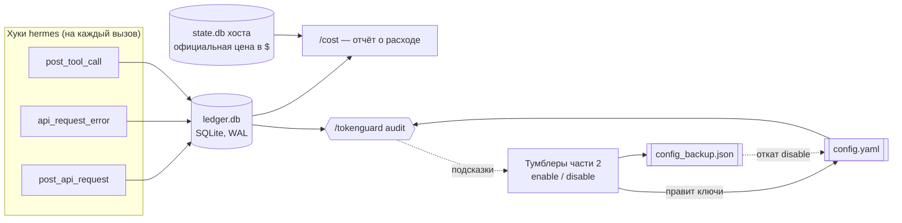

<h1 align="center">🛡️ token-guard</h1>
<p align="center"><b>token-guard — это плагин для hermes-agent, который ведёт учёт расхода токенов в SQLite-журнале и, только по явному разрешению, экономит на служебных вызовах — не трогая качество основной модели.</b></p>

<p align="center">
  <a href="LICENSE"></a>
  <a href="#установка"></a>
  <a href="#установка">=0.18" src="https://img.shields.io/badge/hermes--agent-%3E%3D0.18-blueviolet"></a>
  <a href="tests/test_plugin.py"></a>
  <a href="README.en.md"></a>
</p>

<p align="center">
  <a href="#быстрый-старт">Быстрый старт</a> ·
  <a href="#команды">Команды</a> ·
  <a href="#частые-вопросы">FAQ</a> ·
  <a href="README.en.md">English</a> ·
  <a href="https://skorehood.com">skorehood.com</a> ·
  <a href="https://www.youtube.com/@MaximSkorohood">YouTube</a>
</p>

---

## Что делает token-guard?

token-guard — это плагин для [hermes-agent](https://github.com/NousResearch/hermes-agent), который решает две задачи: во‑первых, честно показывает, куда уходят токены и деньги в каждой сессии; во‑вторых, по вашему явному согласию включает конкретные, обратимые способы сэкономить на служебных (не основных) вызовах модели.

Он состоит из двух независимых частей. **Часть 1** — журнал, страж кэша и аудит — работает пассивно и **никогда не меняет поведение модели**, это просто наблюдение. **Часть 2** — три тумблера экономии — выключены по умолчанию, включаются только после того, как вы увидите карточку «экономия → риск → страховка» и явно подтвердите, и откатываются одной командой в любой момент.

## Что это даёт

- **Учёт расходов по каждому запросу.** Каждый вызов модели, ошибка и вызов инструмента пишутся в локальный SQLite-журнал: сколько токенов (вход, выход, кэш-чтение, кэш-запись, рассуждения), какая модель, какая сессия. Команда `/cost` строит из этого отчёт за любой период.
- **Страж кэша.** Плагин ловит момент, когда модель или провайдер меняются посреди сессии — это обнуляет кэш промпта, и следующий запрос идёт по полной цене вместо льготной. Плюс `/cost` показывает hit-rate кэша, чтобы было видно, когда что-то идёт не так.
- **Аудит по реальной статистике, а не догадкам.** `/tokenguard audit` сверяет конфиг с журналом: например, «этот набор инструментов включён, но его не вызывали 14+ дней» — это факт из журнала, а не предположение.
- **До −40–60% на служебных вызовах через тумблеры Части 2** — это оценка по внешним данным (индустриальные бенчмарки, см. раздел «Что и почему сделано»), а не гарантия и не то, что сам плагин что-то доказал заранее. Каждый тумблер включается только через явное подтверждение и в любой момент откатывается одной командой; эффект потом виден в `/cost`.

Важно: то, что наблюдает и считает плагин (Часть 1), **никогда не меняет поведение модели** — это просто журнал и отчёты. Экономят только тумблеры Части 2, и они по умолчанию выключены.

## Как это работает?

Часть 1 работает пассивно: хуки hermes на каждый API-вызов, ошибку и вызов инструмента пишут по одной строке в `ledger.db`. Команда `/cost` берёт токены из этого журнала, а цену в долларах — из собственной базы hermes (`state.db`), чтобы не изобретать свой прайс-лист. `/tokenguard audit` сравнивает `config.yaml` с журналом и выдаёт список подсказок (ничего не правит сама). Часть 2 (тумблеры) правит несколько ключей в `config.yaml`, предварительно сохраняя их старые значения в `config_backup.json` — оттуда же берётся откат.



## Почему не просто конфиг руками?

| Критерий | token-guard | Ручная правка `config.yaml` | Вообще без учёта токенов |
|---|---|---|---|
| Видно расход по сессиям и моделям | Да — `/cost` | Нет | Нет |
| Подсказки строятся по факту использования, а не по памяти | Да — `/tokenguard audit` читает журнал | Нет — нужно помнить самому | Нет |
| Подтверждение риска перед включением экономии | Карточка «экономия → риск → страховка» | Нет, правка применяется сразу | — |
| Откат | Одна команда, побайтовый backup | Вручную, если не забыли сохранить старое значение | — |
| Нужно помнить синтаксис dotted-key hermes | Нет | Да | — |
| Стоимость внедрения | Скопировать папку + одна строка в `config.yaml` | Изучить документацию hermes и не ошибиться в ключе | Ноль, но и данных ноль |

## Быстрый старт

### Установка

Установка — это только файловые операции, без вызовов hermes CLI.

1. Скопируйте всю папку `token-guard` в `%LOCALAPPDATA%\hermes\plugins\token-guard`. Если папки `plugins` там ещё нет — создайте её.
2. Откройте `%LOCALAPPDATA%\hermes\config.yaml` в любом текстовом редакторе и добавьте `token-guard` в список `plugins.enabled`. Если секции `plugins:` в файле нет вообще — допишите её:

   ```yaml
   plugins:
     enabled:
       - token-guard
   ```

3. Сохраните файл. В своём обычном сеансе hermes выполните:

   ```
   /tokenguard status
   ```

   Если плагин подхватился, вы увидите список переключателей (все — «выключен») и подсказку задать дешёвую модель.

## Команды

| Команда | Что делает |
|---|---|
| `/cost [дни]` | Отчёт о расходе за период (по умолчанию 7 дней): число запросов; токены по корзинам (вход/выход/кэш-чтение/кэш-запись/рассуждения); топ-5 моделей по токенам с оценкой $, если цену удалось определить; топ-5 сессий по $ (цена — из базы hermes, официальная); hit-rate кэша и число его сбросов; число ошибок (включая повторённые); список включённых тумблеров. |
| `/tokenguard status` | Какие переключатели включены, какая задана «дешёвая» модель. |
| `/tokenguard audit` | Прогнать проверки конфигурации (см. ниже) — ничего не меняет. |
| `/tokenguard enable <toggle>` | Показать карточку риска «экономия → риск → страховка» и попросить повторить с `confirm`. |
| `/tokenguard enable <toggle> confirm` | Применить переключатель. |
| `/tokenguard disable <toggle>` | Откатить переключатель к состоянию до включения. |
| `/tokenguard set-cheap-model <provider> <model>` | Задать «дешёвую» модель для `cheap_aux` / `cheap_delegation` — без неё эти два тумблера не включатся. |
| `hermes token-guard cost\|status\|audit\|enable\|disable\|set-cheap-model ...` | Те же самые команды из терминала. |

### Аудит (`/tokenguard audit`)

Ничего не правит автоматически — только подсказки, каждая опирается на реальные данные из журнала или конфига:

1. `prompt_caching.cache_ttl` не задан или равен `5m`, а в журнале больше одной сессии — подсказка включить `cache_1h`.
2. `auxiliary.compression.model` не задан — суммаризация идёт основной (обычно дорогой) моделью. Если задан — по возможности сравнивается размер контекстного окна со основной моделью; если сравнить не получилось, честно пишем «проверьте вручную».
3. `delegation.model` не задан — подсказка включить `cheap_delegation`.
4. Включённые наборы инструментов, которыми не пользовались 14+ дней (по данным журнала) — кандидат на отключение, это уменьшит размер схем в каждом запросе. token-guard **не отключает** их сам, только называет.
5. Сверка `config_backup.json` с текущим реестром переключателей — находит записи от неизвестных/устаревших тумблеров.

## Какие есть тумблеры (Часть 2)?

Все выключены по умолчанию. Карточка риска показывается перед первым включением и всегда в формате **экономия → риск → страховка**.

| Тумблер | По умолчанию | Что правит в `config.yaml` | Предусловие |
|---|---|---|---|
| `cheap_aux` | выключен | `auxiliary.compression.model/provider`, `auxiliary.title_generation.model/provider` | задана дешёвая модель (`/tokenguard set-cheap-model`) |
| `cheap_delegation` | выключен | `delegation.model/provider` | задана дешёвая модель (`/tokenguard set-cheap-model`) |
| `cache_1h` | выключен | `prompt_caching.cache_ttl` → `"1h"` | нет |
| `cron_cascade` | зарезервирован | не реализован | — |
| `context_editing` | зарезервирован | не реализован | — |

**`cheap_aux`** — дешёвая модель для сжатия контекста и заголовков сессий.
- Экономия: суммаризация и заголовки — самые частые служебные вызовы.
- Риск: слабое резюме при сжатии теряет детали навсегда; модель с коротким окном молча выкидывает середину диалога, без предупреждения.
- Страховка: берите длинноконтекстную «флеш»-модель; `/tokenguard audit` сверяет размер окна после включения; откат — `/tokenguard disable cheap_aux`.

**`cheap_delegation`** — дешёвая модель для сабагентов.
- Экономия: до −50% на делегированных задачах (поиск, сбор информации).
- Риск: глубокие рассуждения в сабагенте могут просесть по качеству.
- Страховка: не делегируйте тяжёлые задачи или отключите тумблер; откат — `/tokenguard disable cheap_delegation`.

**`cache_1h`** — кэш промптов на 1 час вместо 5 минут.
- Экономия: чтение кэша стоит ~10% обычной цены; час выгоден, если между сообщениями бывают паузы.
- Риск: запись в кэш на 1 час дороже (2× вместо 1.25× у 5-минутного) — при очень редких сообщениях экономия может обнулиться.
- Страховка: `/cost` покажет hit-rate; откат — `/tokenguard disable cache_1h`.

**Зарезервированные (пока не реализованы):** `cron_cascade`, `context_editing` — команда ответит «зарезервировано, появится в следующей версии».

## Что дальше (roadmap v2)

Планы, не обещания с датой — всё ниже помечено как задумано, но ещё не реализовано:

- **HTML-отчёты для `/cost`** — сейчас отчёт только текстовый, в чате; в v2 добавится экспорт в читаемый HTML-файл.
- **`cron_cascade`** — тумблер для каскада моделей по расписанию (сейчас зарезервирован, команда отвечает «появится в следующей версии»).
- **`context_editing`** — тумблер точечного редактирования контекста без полной пересборки промпта (сейчас зарезервирован по той же причине).

## Что и почему сделано

### Почему архитектура в две части?

Пользовательское требование было простым: «экономия без потери ума агента». Поэтому наблюдение (журнал, страж кэша, аудит) и рискованные рычаги экономии разведены жёстко: Часть 1 в принципе не может испортить качество модели, потому что ничего не меняет — только смотрит. Часть 2 (`cheap_aux`, `cheap_delegation`, `cache_1h`) — это явные, по отдельности включаемые, обратимые эксперименты под наблюдением: каждый требует двухшагового подтверждения с карточкой «экономия → риск → страховка», пишет минимальный диф в `config.yaml` с побайтовой резервной копией и откатывается одной командой. Эффект каждого эксперимента виден в `/cost`.

### Почему журнал — это SQLite, и почему доллары не считаются в хуках?

Хуки (`post_api_request`, `api_request_error`, `post_tool_call`) вызываются hermes синхронно, прямо в рабочем цикле агента — значит, они обязаны быть быстрыми и никогда не бросать исключение. Поэтому каждый обработчик — это одна `INSERT`-вставка в SQLite (WAL-режим), обёрнутая в `try/except`: сбой журнала не должен уронить сессию. Доллары умышленно не считаются внутри хуков — их считает сам hermes и кладёт в `sessions.estimated_cost_usd`; `/cost` читает эту цифру через `SessionDB(read_only=True)` (без блокировки на запись и без своей копии прайс-листа, которая неизбежно разъедется с хостовой). В хуках доступны только корзины токенов — это проверено прямо по коду hermes, а не предположено.

### Почему тумблеры устроены именно так?

Переключатели пишут ключи `config.yaml` через штатный `hermes_cli.config.set_config_value` (безопасный построчный «dotted-key» writer), а не руками. В процессе выяснились три вещи, которые пришлось обойти:

- `set_config_value` делает `sys.exit(1)`, если ключ заблокирован managed-конфигурацией (например, NixOS-сборки). `SystemExit` — это `BaseException`, а не `Exception`, обычный `except Exception` его не поймает. Поэтому `enable`/`disable`/`set-cheap-model` ловят `(Exception, SystemExit)` явно вокруг каждого вызова — управляемый ключ никогда не уронит процесс hermes целиком, пользователь просто получит обычное сообщение об ошибке.
- У хоста нет способа **удалить** ключ конфига — только записать значение. Поэтому «откатить к состоянию, когда ключа вообще не было» сделано вручную: чтение сырого `config.yaml`, удаление dotted-ключа с чисткой опустевших родительских словарей, запись обратно напрямую (в обход `save_config()`, который не гарантирует побайтовый откат из-за нормализации и отбрасывания дефолтов).
- `auxiliary.session_search.*` в этой версии hermes (0.18.0) — мёртвый конфиг: движок его больше не читает. Поэтому `cheap_aux` правит только `auxiliary.compression.*` и `auxiliary.title_generation.*`, а не `session_search`, хотя в изначальном ТЗ он тоже упоминался.

### Почему именно эти три тумблера — и почему не другие рычаги?

Каждый тумблер стоит на конкретной цифре или прецеденте, а не на догадке:

- **Кэш** — чтение кэша стоит около 10% цены обычного входного токена (прайсинг Anthropic); при этом запись в часовой кэш дороже (2×), чем в пятиминутный (1.25×) — поэтому час сделан тумблером с явным риском, а не включён по умолчанию.
- **Схемы инструментов** — замерено на стоковом hermes: ~21–26 тысяч токенов на каждый запрос уходит только на описания инструментов. Это не тумблер token-guard (см. ниже, почему), но это часть доказательной базы, почему аудит вообще проверяет неиспользуемые тулсеты.
- **Дешёвые модели для сабагентов** — это не гипотеза: телеметрия Claude Code показывает 36% вызовов сабагентов на Haiku, а трёхуровневый роутинг даёт −51% стоимости сессии. `cheap_delegation` переносит этот же приём в hermes.
- **Ловушка модели сжатия** — если у модели компрессии окно меньше, чем у основной модели, она молча теряет середину диалога без итогового summary — это задокументированный риск в самой документации hermes, и именно поэтому `/tokenguard audit` явно сравнивает размеры окон, а карточка риска `cheap_aux` прямо предупреждает об этом.
- **Что мы намеренно НЕ строим повторно**: ленивые схемы инструментов и умный роутинг запросов (`smart_model_routing`) — это встроенные фичи, которые сейчас разрабатываются в самом hermes выше по течению (PR #53193, #58838, #59390). Дублировать их плагином — плодить конфликт с апстримом; когда их смержат, `/tokenguard audit` подскажет включить.

### Какие ограничения окружения формировали код?

Для обычных (не bundled) плагинов hermes нет механизма `pip_dependencies`, поэтому весь код — только стандартная библиотека Python (`sqlite3`, `json`, `threading`, `pathlib`...). Все «тяжёлые» или хостовые импорты (`hermes_cli.config`, `agent.usage_pricing`, `agent.model_metadata`, `model_tools`, `hermes_state`) сделаны лениво — внутри функций, а не на уровне модуля — и обёрнуты так, что при недоступности API плагин просто показывает «н/д» или «проверьте вручную», а не падает. Всё состояние плагина лежит под `get_hermes_home()/token-guard/`. Все тексты для пользователя — на простом русском языке; в коде и комментариях — English.

## Какие есть ограничения?

- Проверка «есть ли сессии через шлюз» (правило аудита №1) — эвристика: «в журнале больше одной уникальной сессии». В журнале нет колонки `platform` (её нет и в спецификации таблиц), поэтому отличить телеграм от обычного чата плагин не может — но на практике эвристика хорошо коррелирует с длительным/повторяющимся использованием.
- Оценка $ по отдельной модели (`agent.usage_pricing.estimate_usage_cost`) и сверка окна модели сжатия (`agent.model_metadata.get_model_context_length`) — лучшее из возможного: при сбое или незнакомой модели плагин просто пишет «н/д» / «проверьте вручную» и не падает.
- В используемой версии hermes-agent (v0.18.0, локальная сборка) блок `auxiliary.session_search.*` больше не используется движком — `cheap_aux` поэтому правит только `auxiliary.compression.*` и `auxiliary.title_generation.*`, а не `session_search`.
- `set_config_value` умеет только **писать** значение, не умеет удалять ключ. Поэтому «откат к отсутствовавшему ключу» в `disable` реализован через чтение сырого `config.yaml`, ручное удаление dotted-ключа с чисткой опустевших родительских словарей и запись обратно напрямую — в обход `save_config()` (тот не гарантирует побайтовый откат из-за стрип-дефолтов и нормализации).
- Если `config.yaml` вообще не существовал до первого `enable` (совсем свежий `HERMES_HOME`), путь «ключ отсутствовал» после `disable` оставляет пустой `config.yaml` (`{}`) вместо полного отсутствия файла — по смыслу то же самое (пустой набор настроек), но не побайтово то же, что «файла нет». На практике `ensure_hermes_home()` почти всегда создаёт `config.yaml` раньше, чем плагин впервые используется, так что это крайний случай.
- `set_config_value` вызывает `sys.exit(1)`, если ключ заблокирован managed-конфигурацией (например, NixOS-сборки). `SystemExit` — это `BaseException`, а не `Exception`, обычный `except Exception` его не ловит. `toggles.py` (`enable`/`disable`/`set-cheap-model`) ловит `(Exception, SystemExit)` явно вокруг каждого вызова `set_config_value`, чтобы управляемый ключ никогда не уронил весь процесс hermes — вместо этого пользователь получит обычное сообщение об ошибке.
- Включение тумблера не атомарно: сначала пишется резервная копия, потом по очереди применяются ключи. Если сбой случится посередине, `disable` всё равно корректно откатит то, что успело примениться (или ничего, если бэкап уже сохранён, но ни один ключ ещё не записан) — самолечение через тот же путь восстановления.
- Правило аудита про неиспользуемые наборы инструментов требует минимум 14 дней истории в журнале — на новой установке оно молчит, пока данных не накопится.
- Оценки $ по отдельным моделям — лучшее из возможного (best-effort), а не гарантированно точная цена: официальная цифра — только `estimated_cost_usd`/`actual_cost_usd` из базы самого hermes, которую и показывает `/cost` в разделе «топ-5 сессий».

## Частые вопросы

**Сколько реально экономит token-guard?**
До −40–60% на служебных вызовах (сжатие контекста, заголовки, делегирование сабагентам) — это оценка по внешним данным (индустриальные бенчмарки роутинга моделей), а не гарантия и не число, которое доказал сам плагин заранее. Реальный эффект в вашей сессии смотрите в `/cost` до и после включения тумблера.

**Замедляет ли token-guard агента?**
Часть 1 (журнал, страж кэша, аудит) — нет: это одна `INSERT`-вставка в SQLite на каждый вызов, обёрнутая в `try/except`, не блокирующая рабочий цикл. Часть 2 может повлиять на качество ответов служебных вызовов (не основной модели), если выбрана слишком слабая «дешёвая» модель — поэтому каждый тумблер сопровождается картой риска и страховкой.

**Может ли он сломать hermes или испортить конфиг?**
Каждая запись в `config.yaml` идёт через штатный `hermes_cli.config.set_config_value`, а не напрямую в файл. Если ключ заблокирован managed-конфигурацией, плагин ловит это исключение и не роняет процесс hermes — вы получите обычное сообщение об ошибке. Перед первым включением тумблера сохраняется побайтовая резервная копия старых значений.

**Как откатить изменения, если что-то не понравилось?**
Одной командой: `/tokenguard disable <toggle>`. Плагин восстанавливает прежние значения ключей из `config_backup.json` или удаляет ключ, если его вообще не было до включения. Подтверждение для отката не требуется.

**Работает ли token-guard без интернета?**
Да, для Части 1 (журнал, страж кэша, аудит) — весь код на стандартной библиотеке Python, никаких сетевых вызовов сам плагин не делает. Оценка цены в долларах и информация о моделях берутся из локальных баз данных самого hermes, а не по сети.

**Что token-guard НЕ делает?**
Не отключает ничего сам — только называет кандидатов (например, неиспользуемые наборы инструментов) в `/tokenguard audit`. Не строит заново то, что уже разрабатывается в самом hermes (ленивые схемы инструментов, `smart_model_routing`) — ждёт, пока это смержат в апстрим. Не гарантирует точность оценки $ по отдельным моделям — это best-effort, официальная цифра всегда берётся из базы hermes.

**Нужно ли устанавливать какие-то зависимости?**
Нет. Обычные (не bundled) плагины hermes не поддерживают `pip_dependencies`, поэтому весь код token-guard написан на стандартной библиотеке Python — установка сводится к копированию папки и одной строке в `config.yaml`.

## Документация

Полная методичка команд, диагностика и типовые дешёвые модели — в [`skill/token-guard/references/guide.md`](skill/token-guard/references/guide.md). Инженерные детали реализации — в [`DESIGN.md`](DESIGN.md).

## Made by

Сделано **Maxim Vasko** — [skorehood.com](https://skorehood.com) · [YouTube](https://www.youtube.com/@MaximSkorohood)

## Лицензия

MIT — copyright © 2026 Maxim Vasko. Полный текст — в [`LICENSE`](LICENSE).
